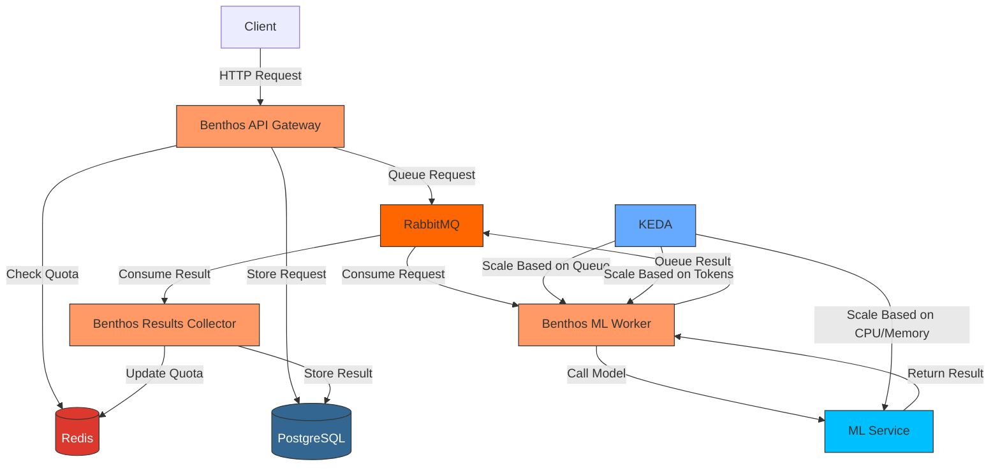
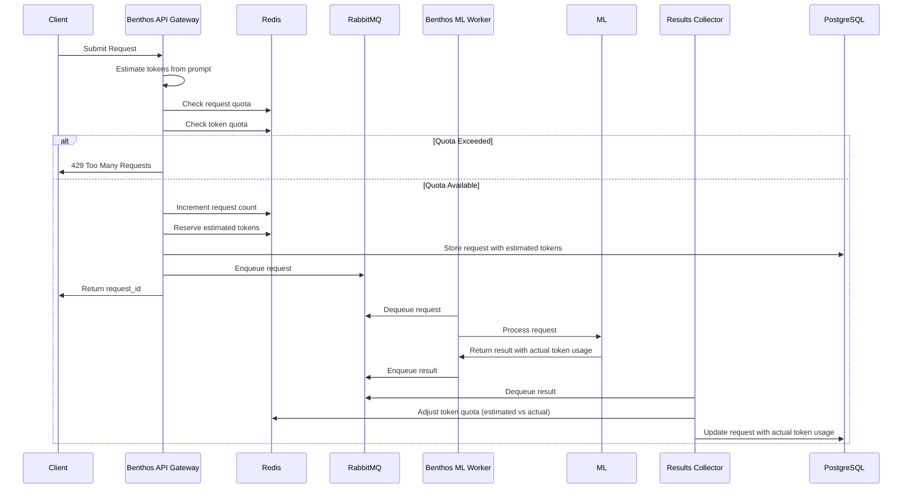
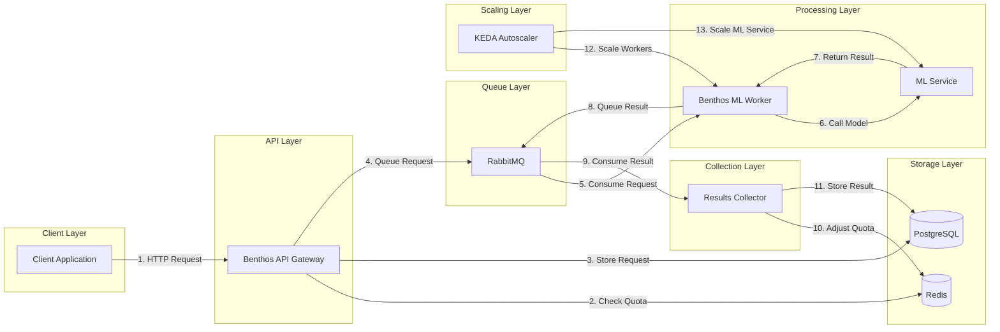
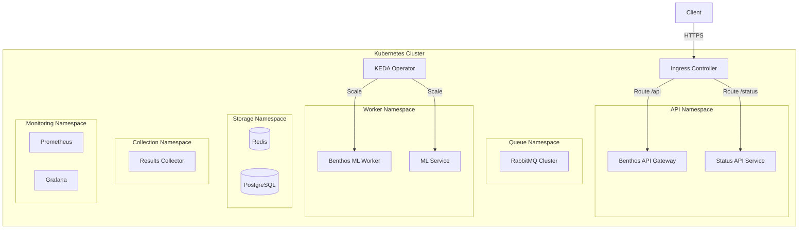
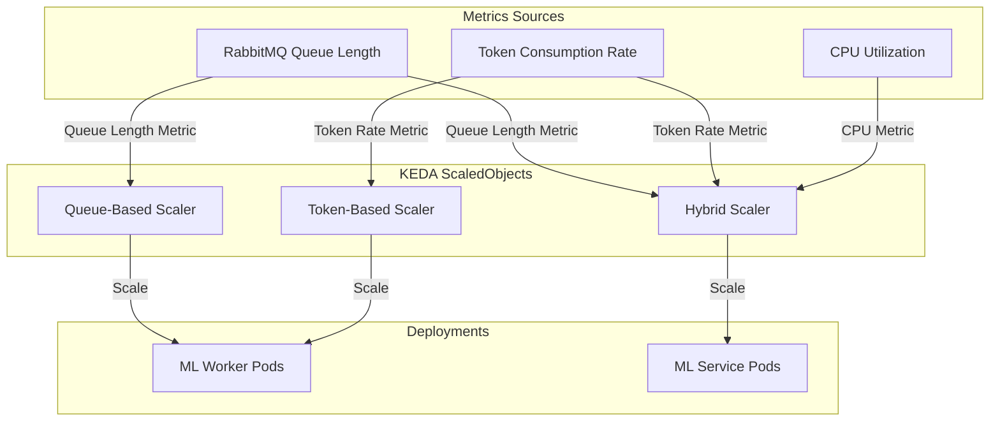

# ML Inference Architecture

A scalable, configuration-driven architecture for ML inference workloads on Kubernetes with token-based quota management.

## Architecture Overview

This architecture enables high-throughput, scalable ML inference with sophisticated quota management, automatic scaling, and minimal custom code.



## Key Components

### 1. Benthos Components

Benthos serves as the configuration-driven glue connecting all system components:

#### API Gateway
- Receives HTTP requests from clients
- Validates requests and enforces token-based quotas
- Forwards requests to RabbitMQ

#### ML Worker
- Consumes requests from RabbitMQ
- Calls ML services
- Returns results to response queues

#### Results Collector
- Consumes results from RabbitMQ
- Updates token quotas with actual usage
- Stores results in PostgreSQL

### 2. Message Queue (RabbitMQ)

- Decouples components for scalability
- Provides reliable message delivery
- Supports priority queues for important requests

### 3. Databases

#### Redis
- Manages real-time token and request quotas
- Provides rate limiting
- Enables fast lookups and caching

#### PostgreSQL
- Stores request history and results
- Tracks token usage for billing
- Maintains user accounts and quotas

### 4. Autoscaling (KEDA)

- Scales ML workers based on queue length
- Scales based on token consumption metrics
- Scales to zero when idle to save costs

### 5. ML Services

- Containerized ML models
- Expose prediction APIs
- Report token usage metrics

## Token-Based Quota Management

This architecture implements sophisticated token-based quota management to accurately track and limit resource usage:



### Token Quota Flow

1. **Estimation**: API Gateway estimates token usage based on prompt length
2. **Reservation**: Estimated tokens are reserved in Redis quota
3. **Processing**: ML service processes the request and reports actual token usage
4. **Adjustment**: Results Collector adjusts the quota based on actual usage
5. **Tracking**: PostgreSQL stores token usage for billing and analytics

## Data Flow



## Deployment Architecture

The system is deployed on Kubernetes with the following components:



## Token-Based Autoscaling

KEDA scales components based on both queue length and token consumption:



## Component Documentation

For detailed documentation on each component:

- [Benthos Documentation](docs/02-core-components/benthos/concepts.md)
- [RabbitMQ Documentation](docs/02-core-components/rabbitmq/concepts.md)
- [PostgreSQL Documentation](docs/02-core-components/postgresql/concepts.md)
- [Redis Documentation](docs/02-core-components/redis/concepts.md)
- [KEDA Documentation](docs/02-core-components/keda/concepts.md)
- [Architecture Overview](docs/01-architecture/overview.md)

## Getting Started

### Prerequisites

- Kubernetes cluster
- Helm 3+
- kubectl

### Installation

```bash
# Add Helm repositories
helm repo add bitnami https://charts.bitnami.com/bitnami
helm repo add kedacore https://kedacore.github.io/charts
helm repo update

# Install RabbitMQ
helm install rabbitmq bitnami/rabbitmq -f helm-values/rabbitmq-values.yaml

# Install PostgreSQL
helm install postgresql bitnami/postgresql -f helm-values/postgresql-values.yaml

# Install Redis
helm install redis bitnami/redis -f helm-values/redis-values.yaml

# Install KEDA
helm install keda kedacore/keda -n keda --create-namespace

# Deploy Benthos components
kubectl apply -f k8s/benthos/
```

### Configuration

The system is primarily configured through:

1. **Benthos YAML files**: Define data flows and transformations
2. **Kubernetes manifests**: Define deployment parameters
3. **KEDA ScaledObjects**: Define scaling behaviors

## License

[MIT License](LICENSE)

## Architecture Improvements

After reviewing the initial implementation, we've identified several improvements to enhance maintainability, reduce duplication, and improve separation of concerns:

### 1. Configuration Management

- **Centralized Configuration**: Move all environment-specific configuration to Helm values or Kustomize overlays
- **DRY Benthos Configs**: Use Benthos includes/imports to share common configuration blocks
- **ConfigMap Generation**: Generate Kubernetes ConfigMaps from the source Benthos YAML files

### 2. Component Decoupling

- **API Service Refactoring**:
  - Move token estimation to a separate microservice or library
  - Separate quota management logic from request handling
  - Use dependency injection for database and message queue clients

- **Benthos Pipeline Modularization**:
  - Break down large pipelines into smaller, reusable components
  - Use Benthos resources for common processors

### 3. Deployment Simplification

- **Helm Charts**: Create Helm charts for each component with shared values
- **CI/CD Pipeline**: Automate deployment with proper environment separation
- **Secrets Management**: Use Kubernetes secrets for sensitive information

### 4. Code Organization

```
├── src/
│   ├── api-service/           # Node.js API service
│   │   ├── src/
│   │   │   ├── controllers/   # Request handlers
│   │   │   ├── services/      # Business logic
│   │   │   ├── models/        # Data models
│   │   │   ├── utils/         # Utilities (including tokenizer)
│   │   │   └── config/        # Configuration
│   │   └── ...
│   │
│   ├── ml-inference/          # Python ML service
│   │   ├── app/
│   │   │   ├── models/        # ML model wrappers
│   │   │   ├── api/           # API endpoints
│   │   │   ├── utils/         # Utilities
│   │   │   └── config/        # Configuration
│   │   └── ...
│   │
│   └── shared-libs/           # Shared libraries
│       ├── token-estimation/  # Token estimation library
│       └── quota-management/  # Quota management library
│
├── config/
│   ├── benthos/
│   │   ├── common/            # Shared Benthos components
│   │   ├── api-gateway/       # API Gateway specific configs
│   │   ├── ml-worker/         # ML Worker specific configs
│   │   └── results-collector/ # Results Collector specific configs
│   │
│   ├── database/              # Database schemas and migrations
│   └── redis/                 # Redis schemas and scripts
│
├── deploy/
│   ├── helm/                  # Helm charts
│   │   ├── api-service/
│   │   ├── ml-inference/
│   │   ├── benthos/
│   │   └── common/            # Shared Helm templates
│   │
│   └── kubernetes/            # Raw Kubernetes manifests
│       ├── base/              # Base configurations
│       └── overlays/          # Environment-specific overlays
│
└── scripts/                   # Utility scripts
    ├── local-dev/             # Local development setup
    ├── ci/                    # CI/CD scripts
    └── monitoring/            # Monitoring setup
```

### 5. Monitoring and Observability

- **Unified Logging**: Implement structured logging across all components
- **Centralized Metrics**: Standardize metrics collection and dashboards
- **Distributed Tracing**: Add OpenTelemetry tracing for request flows

### 6. Testing Strategy

- **Unit Tests**: For individual components
- **Integration Tests**: For component interactions
- **End-to-End Tests**: For complete flows
- **Load Tests**: For performance and scaling validation

These improvements will make the system more maintainable, easier to understand, and more robust as it grows.