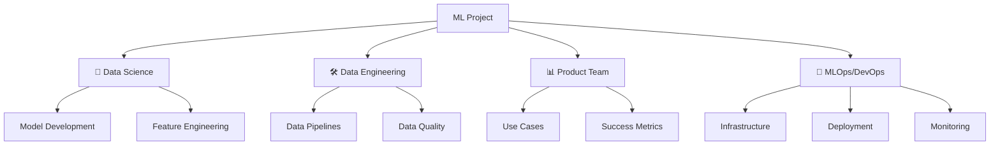
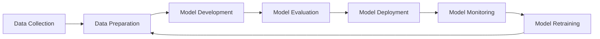
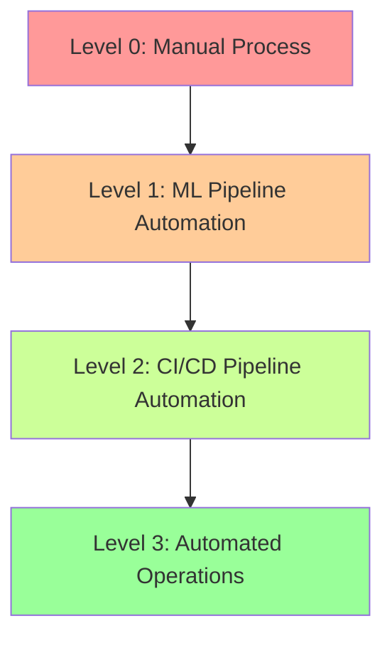

# 🚀 Introduction to MLOps

> *"MLOps is where data science meets software engineering and operations."*

MLOps (Machine Learning Operations) combines ML, DevOps, and Data Engineering to reliably deploy and maintain ML systems in production.

## 👥 The ML Dream Team

A successful ML project requires collaboration across multiple disciplines:

### 📊 Product Team

| Role | Responsibilities |
|------|-----------------|
| Product Manager | Define vision, roadmap, and requirements |
| Business Analyst | Translate business needs to technical requirements |
| UX Designer | Design user experience for ML-powered features |

**Key Activities:**
- 🎯 Identify business use cases with clear ROI
- 🏆 Set measurable business goals
- 📈 Establish success metrics and KPIs
- 🔄 Provide continuous feedback on model performance

### 🧠 Data Science Team

| Role | Responsibilities |
|------|-----------------|
| Data Scientist | Develop and evaluate models |
| ML Researcher | Research new techniques and approaches |
| ML Engineer | Implement and optimize models |

**Key Activities:**
- 🔍 Explore and analyze data
- ⚙️ Create features and train models
- 📊 Evaluate model performance
- 📝 Document model behavior and limitations

### 🛠️ Data Engineering Team

| Role | Responsibilities |
|------|-----------------|
| Data Engineer | Build data pipelines and infrastructure |
| Database Administrator | Manage data storage and access |
| Data Architect | Design data systems and flows |

**Key Activities:**
- 📥 Collect and process data
- 🧹 Clean and transform data
- 🏗️ Build ETL/ELT pipelines
- 🔒 Ensure data quality and security

### 🔄 MLOps/DevOps Team

| Role | Responsibilities |
|------|-----------------|
| MLOps Engineer | Build ML-specific infrastructure |
| DevOps Engineer | Manage deployment and operations |
| SRE | Ensure reliability and performance |

**Key Activities:**
- 🏗️ Design and implement ML infrastructure
- 🔄 Create CI/CD pipelines for ML models
- 📡 Set up monitoring and observability
- 🛡️ Ensure security and compliance

## 🧩 The MLOps Workflow

## 🚧 Common MLOps Challenges

### 🚀 Deployment Challenges
- 🌍 **Where to deploy?** Cloud, on-premise, edge, or hybrid
- 📦 **How to package models** consistently
- 🔌 **Integration with existing systems**
- 🧩 **Managing dependencies** and environments
- 💰 **Optimizing compute resources** and costs

### 🔄 Integration Challenges
- 🔌 **API design** for model serving
- ⏱️ **Latency requirements** for real-time inference
- 🚦 **Traffic management** and load balancing
- ❌ **Error handling** and graceful degradation
- 📊 **Batch vs. real-time** processing

### 🔄 Lifecycle Management
- 📝 **Version control** for models and data
- 🧪 **A/B testing** and experimentation
- 🔄 **Continuous integration** for ML workflows
- 🚀 **Automated deployment** and rollbacks
- 📈 **Performance tracking** over time

## 🌟 MLOps Maturity Model

### 🔴 Level 0: Manual Process
- 👩‍💻 Manual data preparation and training
- 📝 Scripts and notebooks without version control
- 🔄 Manual deployment and monitoring

### 🟠 Level 1: ML Pipeline Automation
- 🔄 Automated data preparation
- 📊 Reproducible model training
- 📝 Version control for code and models
- 👩‍💻 Manual deployment and monitoring

### 🟢 Level 2: CI/CD Pipeline Automation
- 🧪 Automated testing and validation
- 🚀 Continuous deployment of models
- 📊 Basic monitoring and alerting
- 📝 Model registry and versioning

### 🔵 Level 3: Automated Operations
- 🔄 Automated retraining based on triggers
- 📊 Advanced monitoring for model and data drift
- 🧪 Automated A/B testing and rollout
- 🛠️ Self-healing infrastructure

## 💡 Why MLOps Matters

Traditional DevOps practices alone aren't enough for ML systems because:

| Traditional Software | Machine Learning Systems |
|----------------------|--------------------------|
| Code is deterministic | Models are probabilistic |
| Dependencies are code libraries | Dependencies include data |
| Testing is straightforward | Testing requires statistical validation |
| Monitoring focuses on system health | Monitoring includes model performance |
| Versioning is primarily code | Versioning includes code, data, and models |

## 🔮 The Future of MLOps

As ML becomes more integrated into business operations, we can expect:

- 🤖 **AutoML** becoming more sophisticated
- 🔄 **Continuous learning** systems that adapt in real-time
- 🧩 **Composable ML systems** with reusable components
- 🔒 **Enhanced governance** for responsible AI
- 🌐 **Edge ML** becoming more prevalent

---

In the following sections, we'll explore the ML lifecycle, infrastructure requirements, monitoring strategies, and best practices for implementing MLOps in your organization.