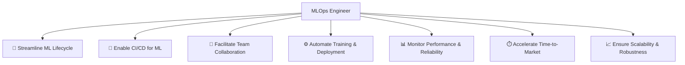
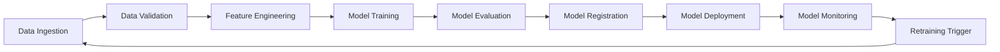
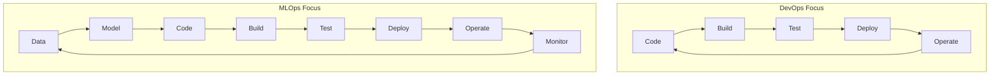
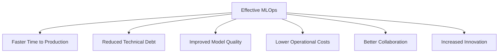

# 👨‍💻 The MLOps Engineer Role

> *"MLOps Engineers are the bridge between data science innovation and production reality."*

## 🔍 Who is an MLOps Engineer?

An MLOps Engineer is a specialized professional who combines DevOps principles with machine learning expertise to:

## 🛠️ Core Skills of an MLOps Engineer

| Skill Area | Required Capabilities |
|------------|----------------------|
| DevOps | CI/CD, Infrastructure as Code, Containerization |
| Software Engineering | Python, API Development, Testing |
| ML/Data Science | Model Training, Evaluation, Feature Engineering |
| Cloud Computing | Kubernetes, Cloud Services, Distributed Systems |
| Data Engineering | Data Pipelines, ETL, Data Validation |
| Monitoring | Metrics Collection, Alerting, Dashboards |

## 🎯 Roles & Responsibilities

### 🔧 DevOps Integration

**Key Activities:**
- 🔄 Blend DevOps practices with ML workflows
- 🚀 Manage operations and deployment for ML systems
- 🔒 Implement security best practices for ML pipelines
- 🧪 Create testing frameworks for ML components

### 📋 Best Practices Implementation

**Key Activities:**
- 📝 Establish standards for model development and deployment
- 🔄 Ensure models are reproducible and traceable
- 📊 Implement model versioning and metadata tracking
- 🧪 Create automated testing for model quality control

### ⚙️ ML Pipeline Development

**Key Activities:**
- 🏗️ Design end-to-end ML pipelines
- 🔄 Automate data processing and model training
- 🚀 Create deployment workflows for models
- 📊 Implement monitoring and feedback loops

### 🚀 Production Impact

**Key Activities:**
- 🔌 Integrate ML models with production systems
- ⚡ Optimize model serving for performance
- 📊 Track business impact of deployed models
- 🔄 Facilitate rapid iteration and improvement

## 🔄 DevOps vs. MLOps: Key Differences

| Aspect | DevOps | MLOps |
|--------|--------|-------|
| **Core Focus** | Development, deployment, automation, integration | Development, deployment, automation, integration, data management, model retraining |
| **Primary Goal** | Shorten system deployment cycles | Automate and manage ML lifecycle |
| **Application** | General software and IT operations | ML development, deployment, and monitoring (e.g., Fraud Detection Model) |
| **Key Stakeholders** | Developers, IT Ops, Security | Data Scientists, Data Engineers, Analysts, ML Engineers |
| **Common Tools** | Docker, Kubernetes, Ansible, Terraform | MLflow, DVC, Kubeflow, TFX, Airflow |
| **Lifecycle Focus** | Code lifecycle and infrastructure | Data lifecycle, model lifecycle, and continuous retraining |
| **Delivery Metrics** | Code delivery, system automation, and reliability | Data versioning, model reproducibility, and performance |
| **Monitoring Emphasis** | System and application performance | Model drift, accuracy, impact on real-world data |
| **Scaling Concerns** | Infrastructure scaling | Scaling ML pipelines and model deployment |

## 🏆 Impact of an Effective MLOps Engineer

**Business Benefits:**
- ⏱️ **Reduced Time-to-Market**: From months to days for model deployment
- 💰 **Cost Efficiency**: Optimized resource utilization
- 📈 **Improved Model Performance**: Continuous monitoring and improvement
- 🔄 **Increased Agility**: Faster iteration and experimentation
- 🔒 **Enhanced Governance**: Better compliance and risk management

## 🛠️ Essential Tools for MLOps Engineers

| Category | Popular Tools | Purpose |
|----------|---------------|---------|
| **Version Control** | Git, DVC | Track code and data changes |
| **CI/CD** | GitHub Actions, Jenkins, GitLab CI | Automate building, testing, deployment |
| **Containerization** | Docker, Kubernetes | Package and orchestrate applications |
| **Experiment Tracking** | MLflow, Weights & Biases | Track model experiments |
| **Feature Store** | Feast, Tecton | Manage and serve features |
| **Model Registry** | MLflow, SageMaker Model Registry | Store and version models |
| **Orchestration** | Airflow, Kubeflow, Argo | Manage workflows and pipelines |
| **Monitoring** | Prometheus, Grafana, Evidently | Track metrics and detect issues |
| **Infrastructure as Code** | Terraform, Pulumi | Manage infrastructure |

## 🎓 Learning Path to Become an MLOps Engineer

1. 🔧 **DevOps Fundamentals**: CI/CD, Infrastructure as Code, Monitoring
2. 🧠 **ML/Data Science Basics**: Python, ML algorithms, Data processing
3. ☁️ **Cloud & Containerization**: Docker, Kubernetes, Cloud services
4. 🔬 **ML Engineering**: Model serving, Optimization, Scaling
5. 🛠️ **MLOps Tools & Practices**: MLflow, Kubeflow, Feature stores
6. 🎯 **Specialization**: NLP, Computer Vision, Recommender Systems, etc.

## 📝 Best Practices for MLOps Engineers

1. 🔄 **Automate Everything**: From data validation to model deployment
2. 📊 **Version Everything**: Code, data, models, and configurations
3. 🧪 **Test Thoroughly**: Data quality, model performance, infrastructure
4. 📝 **Document Extensively**: Decisions, architectures, and processes
5. 🔍 **Monitor Continuously**: System health, model performance, data drift
6. 🔒 **Secure by Design**: Implement security at every stage
7. 🧩 **Modular Architecture**: Create reusable, maintainable components
8. 🤝 **Cross-functional Collaboration**: Work closely with all stakeholders

## 🔮 The Future of MLOps Engineering

As the field evolves, MLOps Engineers will need to adapt to:

- 🤖 **LLMOps**: Specialized practices for large language models
- 🔄 **Continuous Learning Systems**: Models that update in real-time
- 🌐 **Edge MLOps**: Deploying and managing models on edge devices
- 🔒 **Responsible AI**: Implementing fairness, transparency, and governance
- 🧩 **MLOps Platforms**: Integrated solutions for the entire ML lifecycle

---

The MLOps Engineer role continues to evolve as machine learning becomes more central to business operations. By bridging the gap between data science and production systems, MLOps Engineers enable organizations to realize the full potential of their ML investments.

