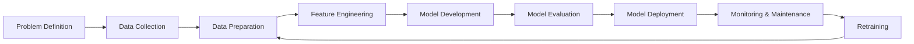
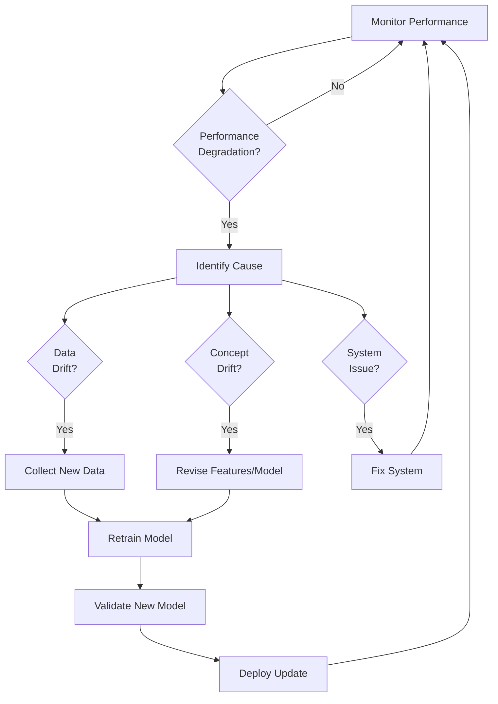

# 🔄 ML Lifecycle Overview

The machine learning lifecycle encompasses all stages from problem definition to model maintenance in production. Understanding this lifecycle is crucial for implementing effective MLOps practices.

## 📊 The Complete ML Lifecycle

## 🎯 Stage 1: Problem Definition

**Key Activities:**
- 🔍 Define the business problem clearly
- 🎯 Set specific, measurable objectives
- 📊 Identify success metrics (business & technical)
- 🧩 Determine if ML is the right approach

**Artifacts:**
- 📝 Problem statement document
- 📊 Success metrics definition
- 📑 Project requirements specification

**MLOps Considerations:**
- 🔄 Ensure alignment between business and technical teams
- 📏 Define measurable KPIs for model performance
- 🧪 Consider how to validate model success

## 📥 Stage 2: Data Collection

**Key Activities:**
- 🔍 Identify data sources
- 📥 Collect and aggregate data
- 📊 Perform initial data assessment
- 🔒 Address data privacy and security concerns

**Artifacts:**
- 📁 Raw datasets
- 📝 Data dictionary
- 📊 Data quality report
- 📑 Data collection pipeline documentation

**MLOps Considerations:**
- 🔄 Create reproducible data collection pipelines
- 📊 Implement data versioning
- 🔒 Ensure compliance with data regulations
- 📈 Monitor data sources for changes

## 🧹 Stage 3: Data Preparation

**Key Activities:**
- 🧹 Clean and preprocess data
- 🔍 Handle missing values
- 🔄 Transform data into suitable formats
- 📊 Perform exploratory data analysis

**Artifacts:**
- 📁 Processed datasets
- 📊 Data quality metrics
- 📝 Data preprocessing scripts
- 📑 EDA reports and visualizations

**MLOps Considerations:**
- 🔄 Create reproducible preprocessing pipelines
- 📊 Track data transformations
- 🧪 Validate data quality at each step
- 📝 Document preprocessing decisions

## ⚙️ Stage 4: Feature Engineering

**Key Activities:**
- ⚙️ Create relevant features
- 🔍 Select important features
- 🔄 Transform features for model compatibility
- 📊 Validate feature effectiveness

**Artifacts:**
- 📁 Feature sets
- 📊 Feature importance analysis
- 📝 Feature engineering scripts
- 📑 Feature documentation

**MLOps Considerations:**
- 🔄 Create reproducible feature engineering pipelines
- 📊 Implement feature stores for reusability
- 🧪 Test feature stability across different data distributions
- 📝 Document feature definitions and transformations

## 🧠 Stage 5: Model Development

**Key Activities:**
- 🔍 Select appropriate algorithms
- ⚙️ Set up training environment
- 🧠 Train models with different parameters
- 🔄 Perform hyperparameter tuning

**Artifacts:**
- 📁 Model training code
- 📊 Training logs
- 📝 Model architecture documentation
- 📑 Hyperparameter tuning results

**MLOps Considerations:**
- 🔄 Create reproducible training pipelines
- 📊 Track experiments and parameters
- 🧪 Implement model versioning
- 📝 Document model architecture and decisions

## 📏 Stage 6: Model Evaluation

**Key Activities:**
- 📏 Evaluate model against metrics
- 🔍 Analyze model errors and limitations
- 🧪 Perform validation on holdout data
- 📊 Compare model performance to baselines

**Artifacts:**
- 📊 Evaluation metrics
- 📝 Error analysis reports
- 📑 Model validation documentation
- 📊 Performance comparison charts

**MLOps Considerations:**
- 🔄 Create standardized evaluation pipelines
- 📊 Track model performance metrics
- 🧪 Implement A/B testing frameworks
- 📝 Document evaluation criteria and results

## 🚀 Stage 7: Model Deployment

**Key Activities:**
- 📦 Package model for deployment
- 🚀 Deploy model to target environment
- 🔌 Integrate with existing systems
- 🧪 Validate deployment success

**Artifacts:**
- 📦 Containerized model
- 📝 Deployment configuration
- 📑 API documentation
- 📊 Deployment validation tests

**MLOps Considerations:**
- 🔄 Implement CI/CD pipelines for model deployment
- 📊 Create deployment strategies (canary, blue/green)
- 🧪 Automate deployment testing
- 📝 Document deployment architecture

## 📡 Stage 8: Monitoring & Maintenance

**Key Activities:**
- 📡 Monitor model performance
- 🔍 Detect data and concept drift
- 📊 Track prediction quality
- 🛠️ Troubleshoot issues

**Artifacts:**
- 📊 Monitoring dashboards
- 📝 Alert configurations
- 📑 Incident response playbooks
- 📊 Performance reports

**MLOps Considerations:**
- 🔄 Implement automated monitoring systems
- 📊 Set up alerting for performance degradation
- 🧪 Create model health checks
- 📝 Document monitoring metrics and thresholds

## 🔄 Stage 9: Retraining

**Key Activities:**
- 🔍 Identify retraining triggers
- 📥 Collect new training data
- 🔄 Retrain models with updated data
- 🚀 Deploy updated models

**Artifacts:**
- 📊 Retraining criteria
- 📝 Retraining pipelines
- 📑 Model update documentation
- 📊 Performance improvement metrics

**MLOps Considerations:**
- 🔄 Implement automated retraining pipelines
- 📊 Track model versions and performance
- 🧪 Validate new models before deployment
- 📝 Document retraining decisions and results

## 🔄 Continuous Improvement Loop

The ML lifecycle is not linear but cyclical, with continuous feedback and improvement:

## 📝 Best Practices for ML Lifecycle Management

1. 📊 **Version Everything**: Code, data, models, and configurations
2. 🔄 **Automate Where Possible**: Reduce manual steps to improve reproducibility
3. 📝 **Document Decisions**: Record why choices were made at each stage
4. 🧪 **Test Thoroughly**: Implement comprehensive testing at each stage
5. 🔍 **Monitor Continuously**: Set up robust monitoring from day one
6. 🔄 **Plan for Retraining**: Design systems with model updates in mind
7. 🧩 **Modular Design**: Create components that can be reused and replaced
8. 🔒 **Security First**: Implement security measures throughout the lifecycle

## 🛠️ Tools for ML Lifecycle Management

| Stage | Popular Tools |
|-------|--------------|
| Data Collection | Airflow, Kafka, NiFi |
| Data Preparation | Pandas, Spark, dbt |
| Feature Engineering | Feature Store, Feast, Tecton |
| Model Development | TensorFlow, PyTorch, scikit-learn |
| Experiment Tracking | MLflow, Weights & Biases, Neptune |
| Model Registry | MLflow, DVC, ModelDB |
| Deployment | Docker, Kubernetes, TensorFlow Serving |
| Monitoring | Prometheus, Grafana, Evidently |
| Orchestration | Kubeflow, Airflow, Argo |

In the next section, we'll dive deeper into each stage of the ML lifecycle and explore how to implement MLOps best practices at each step. 