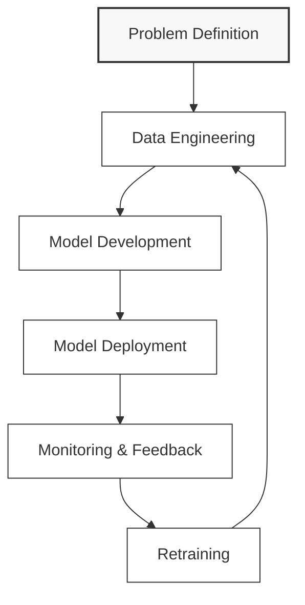
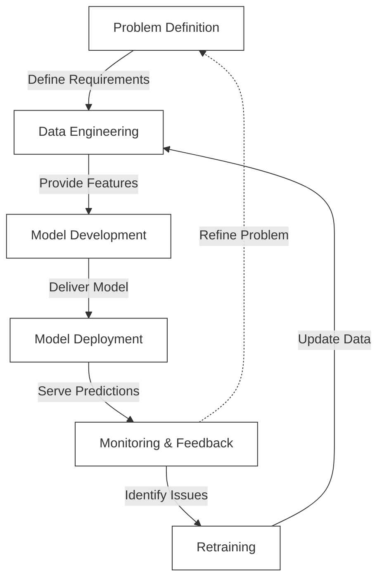

# 🔄 The MLOps Lifecycle

This document provides a practical overview of the MLOps lifecycle stages and how they connect to form a continuous process.

## 🔄 Core Lifecycle Stages

## 🎯 Stage 1: Problem Definition

**Key Focus:** Business Understanding & ML Framing

**Activities:**
- Define business objectives and success metrics
- Translate business problems into ML tasks
- Identify data requirements and constraints
- Set up project tracking and documentation
- Establish stakeholder alignment and expectations

**Deliverables:**
- Problem statement document
- Success metrics definition
- Data requirements specification
- Project timeline and milestones
- Stakeholder approval documentation

## 📊 Stage 2: Data Engineering 

**Key Focus:** Data Exploration, Collection, Transformation & Validation

**Activities:**
- Collect and integrate data from various sources
- Explore data patterns and distributions
- Clean and preprocess data
- Create feature pipelines
- Implement data validation checks
- Set up data versioning
- Ensure data is ready for training

**Deliverables:**
- Data pipelines
- Feature engineering code
- Data quality reports
- Versioned datasets
- Data documentation
- Data exploration notebooks
- Feature specifications

## 🧠 Stage 3: Model Development

**Key Focus:** ML Model Exploration, Training & Evaluation

**Activities:**
- Experiment with different algorithms
- Train and tune models
- Evaluate model performance
- Document model architecture and decisions
- Version models and experiments
- Compare model performance against baselines
- Analyze model behavior and limitations

**Deliverables:**
- Trained models
- Experiment logs
- Evaluation reports
- Model documentation
- Model registry entries
- Performance comparison analysis
- Model cards

## 🚀 Stage 4: Model Deployment

**Key Focus:** Testing, Packaging & Infrastructure Setup

**Activities:**
- Package models for deployment
- Set up serving infrastructure
- Implement deployment pipelines
- Configure scaling and load balancing
- Perform deployment validation
- Plan deployment strategy (canary, blue/green)
- Test model in production-like environments

**Deliverables:**
- Containerized model
- Deployment configuration
- API documentation
- Deployment pipeline
- Validation test results
- Rollback procedures
- Performance benchmarks

## 📡 Stage 5: Monitoring & Feedback

**Key Focus:** Operations Evaluation & Performance Tracking

**Activities:**
- Monitor model performance and predictions
- Track data and concept drift
- Collect ground truth data
- Analyze business impact
- Set up alerting for issues
- Gather user feedback
- Identify improvement opportunities

**Deliverables:**
- Monitoring dashboards
- Drift detection reports
- Performance metrics
- Business impact analysis
- Alert configurations
- Feedback collection mechanisms
- Improvement recommendations

## 🔄 Stage 6: Retraining

**Key Focus:** Model Refresh & Continuous Improvement

**Activities:**
- Determine retraining triggers
- Update training data
- Retrain models with new data
- Validate new models
- Deploy updated models
- Document model changes
- Measure improvement over previous versions

**Deliverables:**
- Retraining criteria
- Updated datasets
- New model versions
- Comparison reports
- Deployment plans
- Change documentation
- Performance improvement metrics

## 🔄 Connecting the Stages

The MLOps lifecycle is not a linear process but a continuous loop:

**Key Integration Points:**

1. **Feedback Loops**: Each stage provides feedback to previous stages
   - Monitoring insights inform retraining needs
   - Deployment challenges improve model development
   - Model performance refines problem definition

2. **Automation**: Automate transitions between stages where possible
   - Automated data pipelines
   - CI/CD for model deployment
   - Automated monitoring and alerting

3. **Versioning**: Track changes across all stages
   - Code versioning
   - Data versioning
   - Model versioning
   - Configuration versioning

4. **Documentation**: Document decisions and artifacts at each stage
   - Decision logs
   - Model cards
   - Data dictionaries
   - Deployment specifications

5. **Governance**: Apply consistent governance across the lifecycle
   - Access controls
   - Approval workflows
   - Audit trails
   - Compliance checks

## 📋 Implementation Checklist

Use this checklist to ensure your MLOps lifecycle implementation is complete:

### Problem Definition
- [ ] Clear business objectives defined
- [ ] Success metrics established
- [ ] ML approach validated
- [ ] Stakeholder alignment confirmed

### Data Engineering
- [ ] Data sources identified and accessed
- [ ] Data pipeline automated and tested
- [ ] Data quality checks implemented
- [ ] Feature engineering pipeline created
- [ ] Data versioning implemented

### Model Development
- [ ] Experiment tracking set up
- [ ] Model evaluation metrics defined
- [ ] Model versioning implemented
- [ ] Model documentation created
- [ ] Baseline models established

### Model Deployment
- [ ] Model packaging standardized
- [ ] Deployment pipeline automated
- [ ] Scaling configuration established
- [ ] Rollback procedures defined
- [ ] API documentation created

### Monitoring & Feedback
- [ ] Performance monitoring implemented
- [ ] Data drift detection set up
- [ ] Alerting thresholds defined
- [ ] Feedback collection mechanism created
- [ ] Business impact tracking established

### Retraining
- [ ] Retraining triggers defined
- [ ] Automated retraining pipeline created
- [ ] Model validation process established
- [ ] Deployment automation for new models
- [ ] Performance comparison framework implemented