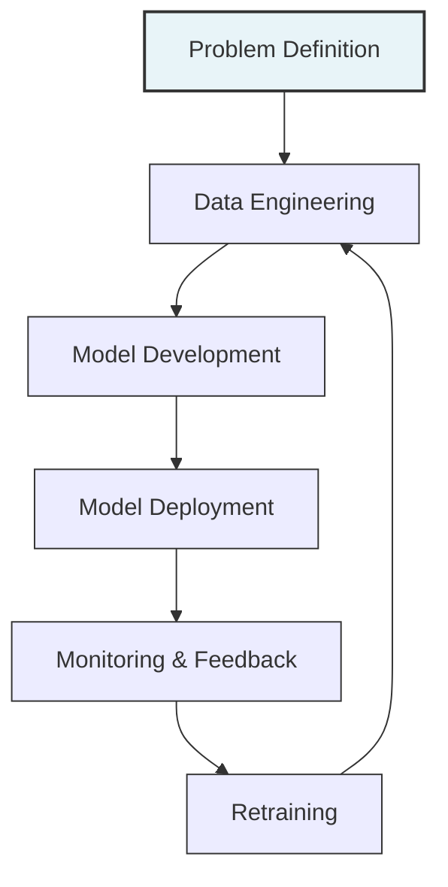

# 🔄 The MLOps Lifecycle

This document provides a practical overview of the MLOps lifecycle stages and how they connect to form a continuous process.

## 🔄 Core Lifecycle Stages

## 🎯 Stage 1: Problem Definition

**Activities:**
- Define business objectives and success metrics
- Translate business problems into ML tasks
- Identify data requirements and constraints
- Set up project tracking and documentation

**Deliverables:**
- Problem statement document
- Success metrics definition
- Data requirements specification
- Project timeline and milestones

## 📊 Stage 2: Data Engineering

**Activities:**
- Collect and integrate data from various sources
- Clean and preprocess data
- Create feature pipelines
- Implement data validation checks
- Set up data versioning

**Deliverables:**
- Data pipelines
- Feature engineering code
- Data quality reports
- Versioned datasets
- Data documentation

## 🧠 Stage 3: Model Development

**Activities:**
- Experiment with different algorithms
- Train and tune models
- Evaluate model performance
- Document model architecture and decisions
- Version models and experiments

**Deliverables:**
- Trained models
- Experiment logs
- Evaluation reports
- Model documentation
- Model registry entries

## 🚀 Stage 4: Model Deployment

**Activities:**
- Package models for deployment
- Set up serving infrastructure
- Implement deployment pipelines
- Configure scaling and load balancing
- Perform deployment validation

**Deliverables:**
- Containerized model
- Deployment configuration
- API documentation
- Deployment pipeline
- Validation test results

## 📡 Stage 5: Monitoring & Feedback

**Activities:**
- Monitor model performance and predictions
- Track data and concept drift
- Collect ground truth data
- Analyze business impact
- Set up alerting for issues

**Deliverables:**
- Monitoring dashboards
- Drift detection reports
- Performance metrics
- Business impact analysis
- Alert configurations

## 🔄 Stage 6: Retraining

**Activities:**
- Determine retraining triggers
- Update training data
- Retrain models with new data
- Validate new models
- Deploy updated models

**Deliverables:**
- Retraining criteria
- Updated datasets
- New model versions
- Comparison reports
- Deployment plans

## 🔄 Connecting the Stages

The MLOps lifecycle is not a linear process but a continuous loop:

1. **Feedback Loops**: Each stage provides feedback to previous stages
2. **Automation**: Automate transitions between stages where possible
3. **Versioning**: Track changes across all stages
4. **Documentation**: Document decisions and artifacts at each stage
5. **Governance**: Apply consistent governance across the lifecycle

## 📋 Implementation Checklist

Use this checklist to ensure your MLOps lifecycle implementation is complete:

- [ ] **Problem Definition**: Clear business objectives and success metrics
- [ ] **Data Pipeline**: Automated, versioned, and validated
- [ ] **Experimentation**: Tracked and reproducible
- [ ] **Model Registry**: Centralized and versioned
- [ ] **Deployment Pipeline**: Automated and tested
- [ ] **Monitoring**: Comprehensive and actionable
- [ ] **Retraining**: Triggered and validated
- [ ] **Documentation**: Complete and accessible