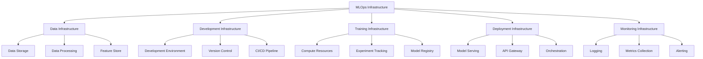
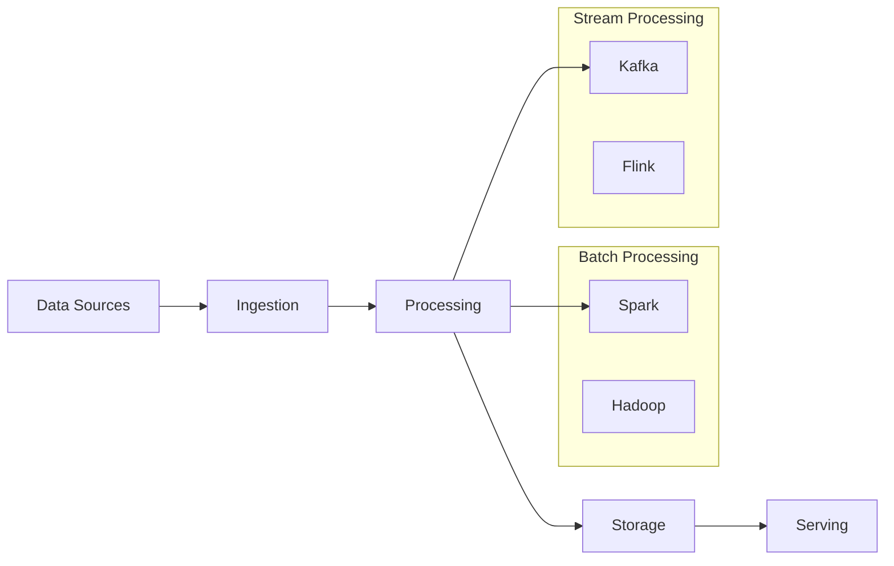
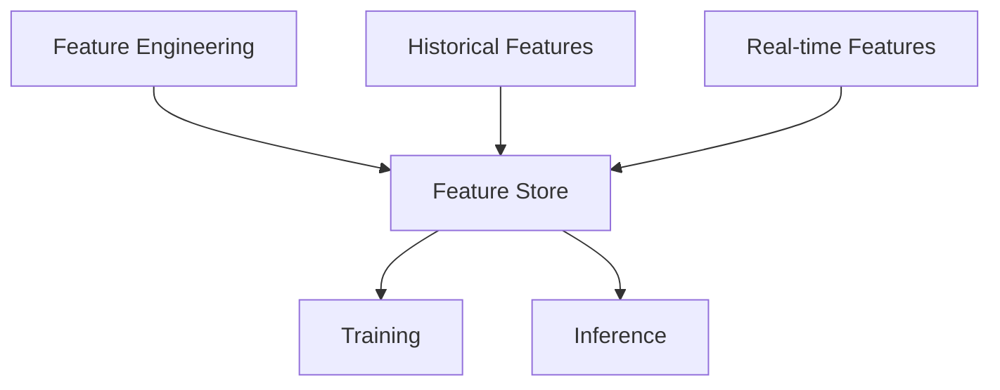
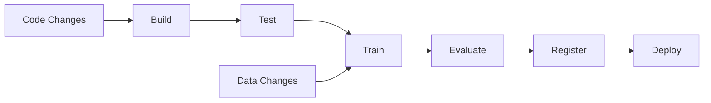
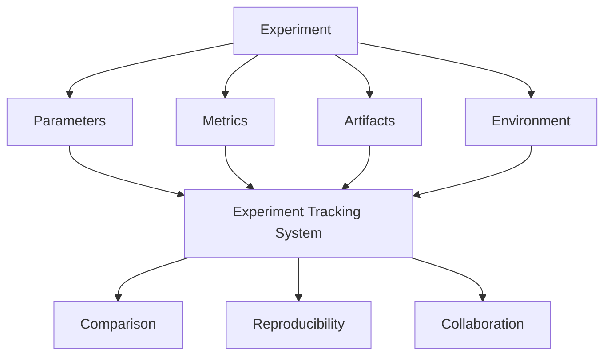
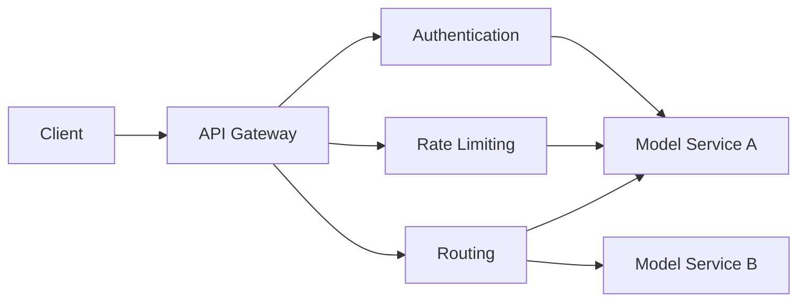
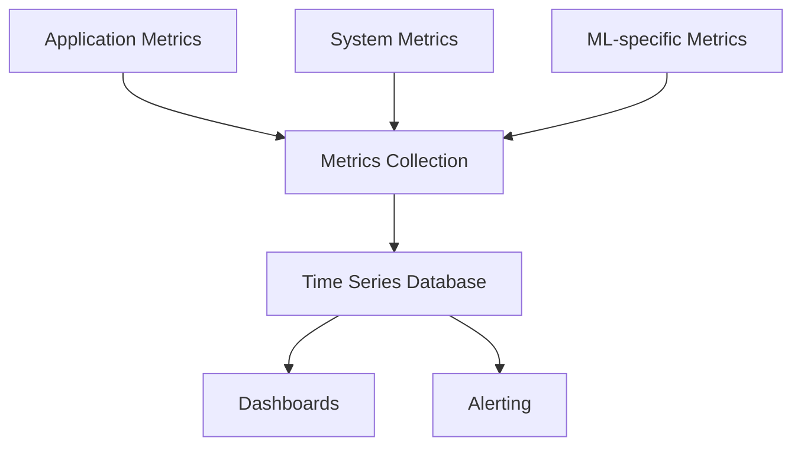
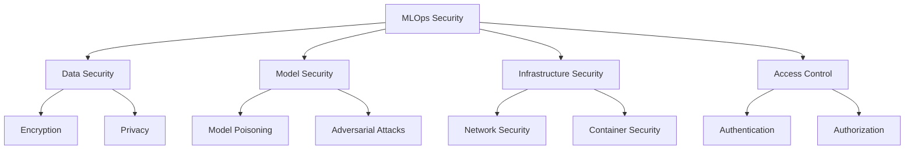
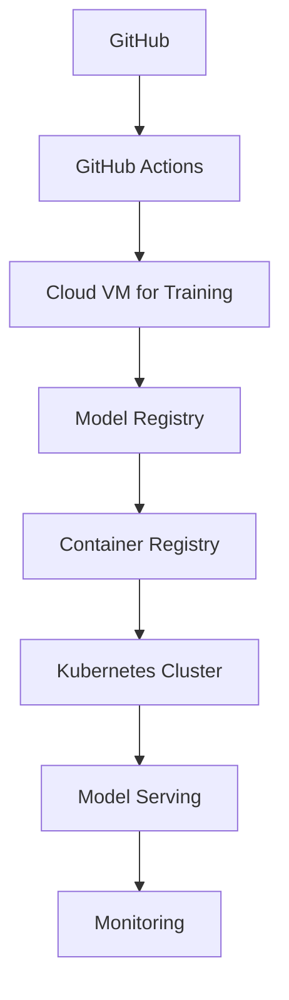
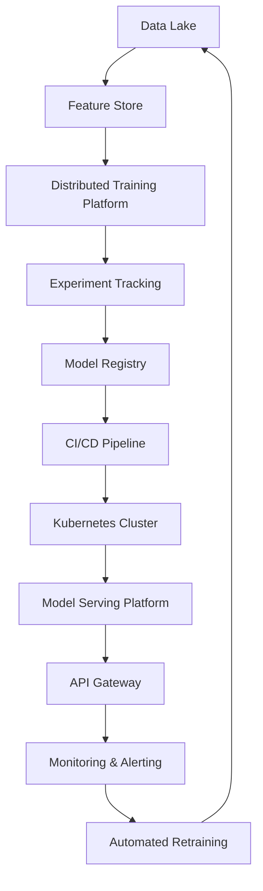

# 🏗️ MLOps Infrastructure Overview

Robust infrastructure is the foundation of successful MLOps implementation. This document outlines the key components of a modern MLOps infrastructure stack.

## 🧩 Core Components of MLOps Infrastructure

## 📊 Data Infrastructure

The foundation of any ML system is its data infrastructure.

### 🗄️ Data Storage Solutions

| Type | Examples | Best For |
|------|----------|----------|
| Data Lakes | S3, Azure Data Lake, GCS | Raw, unstructured data storage |
| Data Warehouses | Snowflake, BigQuery, Redshift | Structured, queryable data |
| Databases | PostgreSQL, MongoDB, Cassandra | Transactional and application data |
| Vector Databases | Pinecone, Weaviate, Milvus | Embedding and similarity search |

**MLOps Considerations:**
- 🔒 Implement proper access controls and encryption
- 📊 Set up data versioning and lineage tracking
- 🔄 Create efficient data pipelines for updates
- 💰 Optimize storage costs for large datasets

### 🔄 Data Processing Systems

**Key Components:**
- 📥 **Data Ingestion**: Kafka, Kinesis, Pub/Sub
- 🔄 **Batch Processing**: Spark, Hadoop, Dask
- ⚡ **Stream Processing**: Flink, Kafka Streams, Spark Streaming
- 🧹 **Data Quality**: Great Expectations, dbt tests, Soda

### 🧩 Feature Store

A feature store centralizes feature engineering and serving:

**Key Capabilities:**
- 🔄 **Feature Versioning**: Track changes to feature definitions
- 🔄 **Feature Sharing**: Reuse features across models
- ⏱️ **Point-in-time Correctness**: Prevent data leakage
- 🚀 **Online Serving**: Low-latency feature retrieval

**Popular Solutions:**
- 🛠️ Feast (open-source)
- 🛠️ Tecton (commercial)
- 🛠️ Hopsworks (open-source)
- 🛠️ Amazon SageMaker Feature Store

## 💻 Development Infrastructure

### 🧪 Development Environments

| Type | Examples | Best For |
|------|----------|----------|
| Local Development | VS Code + Extensions, PyCharm | Individual experimentation |
| Notebooks | Jupyter, Colab, Databricks | Data exploration, prototyping |
| Cloud IDEs | GitHub Codespaces, AWS Cloud9 | Collaborative development |
| ML Platforms | Domino Data Lab, SageMaker Studio | End-to-end ML workflows |

**MLOps Considerations:**
- 🔄 Ensure environment reproducibility with containers or virtual environments
- 📝 Implement notebook-to-production workflows
- 🧪 Enable easy experimentation with quick feedback loops
- 🔒 Secure access to development resources

### 📝 Version Control for ML

Beyond standard code versioning, ML requires:

- 📊 **Data Versioning**: DVC, LakeFS, Pachyderm
- 🧪 **Experiment Versioning**: MLflow, Weights & Biases
- 📦 **Model Versioning**: Model registry systems
- 📝 **Configuration Versioning**: Git + specialized tools

### 🔄 CI/CD for ML

**Key Components:**
- 🧪 **Testing**: Unit tests, integration tests, data validation
- 🔄 **Training Pipelines**: Automated model training
- 📊 **Evaluation**: Automated model validation
- 🚀 **Deployment**: Automated model deployment
- 🔄 **Triggers**: Code changes, data changes, scheduled retraining

**Popular Tools:**
- 🛠️ GitHub Actions / GitLab CI
- 🛠️ Jenkins
- 🛠️ CircleCI
- 🛠️ Specialized ML CI/CD: CML, Kubeflow Pipelines

## 🧠 Training Infrastructure

### 💪 Compute Resources

| Type | Best For | Considerations |
|------|----------|----------------|
| CPUs | Classical ML, data processing | Cost-effective for many workloads |
| GPUs | Deep learning, computer vision | High performance but expensive |
| TPUs | Large-scale deep learning | Specialized for TensorFlow |
| Distributed Systems | Very large models/datasets | Complex to set up and manage |

**Deployment Options:**
- ☁️ **Cloud Providers**: AWS, GCP, Azure
- 🏢 **On-premises**: GPU clusters, HPC
- 🔄 **Hybrid**: Combination of cloud and on-premises

### 📊 Experiment Tracking

**Key Features:**
- 📝 **Parameter Tracking**: Record hyperparameters and configurations
- 📊 **Metric Logging**: Track performance metrics
- 📁 **Artifact Storage**: Save models and other outputs
- 📈 **Visualization**: Compare experiments visually

**Popular Tools:**
- 🛠️ MLflow
- 🛠️ Weights & Biases
- 🛠️ Neptune
- 🛠️ Comet ML

### 📦 Model Registry

A central repository for managing model versions:

**Key Capabilities:**
- 📝 **Version Management**: Track model versions
- 🏷️ **Metadata**: Store information about models
- 🔄 **Lifecycle Management**: Transition models through stages
- 🔒 **Access Control**: Manage who can use models

**Popular Solutions:**
- 🛠️ MLflow Model Registry
- 🛠️ SageMaker Model Registry
- 🛠️ Vertex AI Model Registry
- 🛠️ ModelDB

## 🚀 Deployment Infrastructure

### 📦 Model Serving Options

| Approach | Examples | Best For |
|----------|----------|----------|
| REST APIs | FastAPI, Flask, TF Serving | General-purpose serving |
| Batch Inference | Spark, Kubernetes Jobs | High-throughput, non-real-time |
| Streaming | Kafka + Flink, KServe | Real-time, event-driven |
| Edge Deployment | TensorFlow Lite, ONNX Runtime | Mobile, IoT, edge devices |

**Deployment Patterns:**
- 🔄 **Canary Deployments**: Gradually shift traffic
- 🔄 **Blue/Green Deployments**: Instant cutover
- 🧪 **Shadow Deployments**: Test without affecting users
- 🔄 **A/B Testing**: Compare model versions

### 🔌 API Gateway and Management

**Key Features:**
- 🔒 **Authentication**: Secure access to models
- 🚦 **Rate Limiting**: Control usage and costs
- 📊 **Monitoring**: Track API usage
- 🔄 **Routing**: Direct traffic to appropriate models

**Popular Solutions:**
- 🛠️ Kong
- 🛠️ Amazon API Gateway
- 🛠️ Google Apigee
- 🛠️ Azure API Management

### 🔄 Orchestration

Orchestration systems manage the deployment and scaling of ML services:

**Key Capabilities:**
- 🔄 **Scaling**: Adjust resources based on demand
- 🔄 **Service Discovery**: Find and connect services
- 🔄 **Load Balancing**: Distribute traffic
- 🛡️ **Resilience**: Handle failures gracefully

**Popular Solutions:**
- 🛠️ Kubernetes
- 🛠️ KServe / Seldon Core
- 🛠️ Amazon ECS/EKS
- 🛠️ Google GKE

## 📡 Monitoring Infrastructure

### 📝 Logging Systems

**Key Components:**
- 📝 **Log Collection**: Gather logs from all components
- 🔍 **Log Indexing**: Make logs searchable
- 📊 **Log Analysis**: Extract insights from logs
- 📑 **Log Retention**: Store logs for compliance

**Popular Solutions:**
- 🛠️ ELK Stack (Elasticsearch, Logstash, Kibana)
- 🛠️ Loki + Grafana
- 🛠️ Google Cloud Logging
- 🛠️ AWS CloudWatch Logs

### 📊 Metrics Collection

**Types of Metrics:**
- 🖥️ **System Metrics**: CPU, memory, disk, network
- 📊 **Application Metrics**: Requests, latency, errors
- 🧠 **ML Metrics**: Prediction quality, drift, feature statistics

**Popular Solutions:**
- 🛠️ Prometheus + Grafana
- 🛠️ Datadog
- 🛠️ New Relic
- 🛠️ CloudWatch

### ⚠️ Alerting Systems

**Key Features:**
- 🔍 **Detection**: Identify issues based on thresholds or anomalies
- 📢 **Notification**: Alert appropriate teams
- 📝 **Runbooks**: Provide action plans
- 🔄 **Escalation**: Involve additional teams if needed

**Popular Solutions:**
- 🛠️ Alertmanager (Prometheus)
- 🛠️ PagerDuty
- 🛠️ Opsgenie
- 🛠️ VictorOps

## 🏗️ Infrastructure as Code (IaC)

Managing MLOps infrastructure through code:

**Key Benefits:**
- 🔄 **Reproducibility**: Consistent environments
- 📝 **Version Control**: Track infrastructure changes
- 🔄 **Automation**: Reduce manual setup
- 🧪 **Testing**: Validate infrastructure changes

**Popular Tools:**
- 🛠️ Terraform
- 🛠️ AWS CloudFormation
- 🛠️ Pulumi
- 🛠️ Kubernetes YAML/Helm

## 🔒 Security Considerations

**Key Security Areas:**
- 🔒 **Data Protection**: Encryption, anonymization, access controls
- 🔒 **Model Protection**: Prevent tampering and theft
- 🔒 **Infrastructure Security**: Secure compute resources
- 🔒 **Access Management**: Control who can access what
- 🔒 **Compliance**: Meet regulatory requirements

## 💰 Cost Optimization

**Key Strategies:**
- 🔄 **Right-sizing**: Use appropriate resources
- 🔄 **Auto-scaling**: Scale based on demand
- 💤 **Spot Instances**: Use discounted resources when available
- 📊 **Monitoring**: Track and optimize costs
- 🧪 **Experimentation**: Test cost-saving approaches

## 🌟 Real-world MLOps Infrastructure Examples

### 🏢 Small-scale Setup

### 🏙️ Enterprise-scale Setup

## 📝 Best Practices for MLOps Infrastructure

1. 🔄 **Start Simple**: Begin with essential components and expand
2. 🧩 **Modular Design**: Use loosely coupled components
3. 🔄 **Automation First**: Automate everything possible
4. 📝 **Documentation**: Document infrastructure decisions
5. 🧪 **Testing**: Test infrastructure changes
6. 🔒 **Security**: Implement security at every layer
7. 💰 **Cost Awareness**: Monitor and optimize costs
8. 🔄 **Continuous Improvement**: Regularly review and enhance

In the next section, we'll explore how to implement effective monitoring for ML systems. 