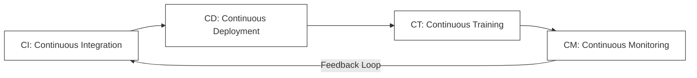
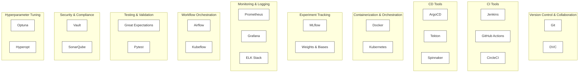
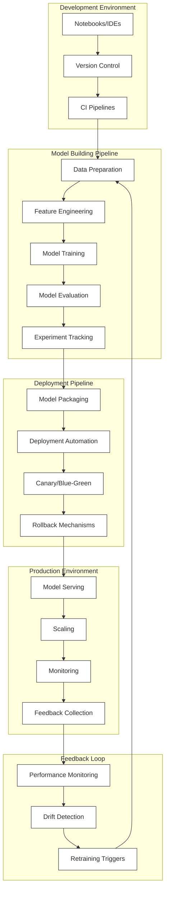

# 🔄 Continuous Integration, Deployment, Training & Monitoring in MLOps

This document explains the continuous practices in MLOps that enable efficient, reliable, and scalable machine learning systems.

## 🔄 The Four Continuous Practices in MLOps

## 🔄 CI: Continuous Integration

**Definition**: Continuous Integration in MLOps involves automatically integrating code changes, data changes, and model updates into a shared repository with automated testing.

**Key Components**:
- **Code Integration**: Merging code changes from multiple contributors
- **Data Integration**: Validating and integrating new data sources
- **Feature Integration**: Testing new features and ensuring compatibility
- **Model Integration**: Validating model changes against baseline performance

**Activities**:
- Automated code testing (unit tests, integration tests)
- Data validation and quality checks
- Feature validation
- Model validation against baseline metrics
- Automated build processes

**Benefits**:
- Early detection of integration issues
- Consistent validation of data and models
- Reduced integration conflicts
- Faster development cycles
- Improved collaboration between data scientists and engineers

## 🚀 CD: Continuous Deployment

**Definition**: Continuous Deployment in MLOps involves automatically deploying ML models to production environments after passing all validation tests.

**Key Components**:
- **Model Packaging**: Containerizing models with dependencies
- **Infrastructure as Code**: Defining deployment environments
- **Deployment Strategies**: Implementing canary, blue/green deployments
- **Rollback Mechanisms**: Enabling quick recovery from failed deployments

**Activities**:
- Automated deployment pipelines
- Environment configuration management
- Deployment validation testing
- Performance testing in staging environments
- Automated rollback procedures

**Benefits**:
- Consistent deployment process
- Reduced deployment errors
- Faster time-to-production
- Lower operational overhead
- Improved reliability and reproducibility

## 🔄 CT: Continuous Training

**Definition**: Continuous Training involves automatically retraining and updating ML models based on new data or detected performance degradation.

**Key Components**:
- **Training Pipelines**: Automated model training workflows
- **Training Triggers**: Events that initiate retraining
- **Model Evaluation**: Comparing new models against existing ones
- **Model Registry**: Versioning and tracking model iterations

**Activities**:
- Scheduled retraining jobs
- Event-triggered retraining
- Hyperparameter optimization
- Model performance evaluation
- Model promotion to production

**Benefits**:
- Models stay relevant with changing data
- Reduced model performance degradation
- Automated response to data drift
- Consistent training procedures
- Traceable model lineage

## 📊 CM: Continuous Monitoring

**Definition**: Continuous Monitoring involves tracking model performance, data quality, and system health in production to detect issues and trigger appropriate actions.

**Key Components**:
- **Performance Monitoring**: Tracking model accuracy and other metrics
- **Data Drift Detection**: Identifying changes in input data distributions
- **Concept Drift Detection**: Detecting changes in the relationship between inputs and outputs
- **Resource Monitoring**: Tracking system resource utilization
- **Business Impact Monitoring**: Measuring the effect on business KPIs

**Activities**:
- Real-time metric collection
- Alerting on threshold violations
- Drift detection and analysis
- Performance degradation detection
- Automated incident response

**Benefits**:
- Early detection of model degradation
- Visibility into production performance
- Data-driven retraining decisions
- Improved model reliability
- Better alignment with business objectives

## 🛠️ MLOps Tools Ecosystem

The MLOps ecosystem includes a wide range of tools that support these continuous practices:

### Key Tool Categories:

1. **Version Control and Collaboration**
   - Git for code version control
   - DVC for data version control

2. **Continuous Integration (CI) Tools**
   - Jenkins
   - GitHub Actions
   - CircleCI

3. **Continuous Deployment (CD) Tools**
   - ArgoCD
   - Tekton
   - Spinnaker

4. **Containerization and Orchestration**
   - Docker
   - Kubernetes

5. **Experiment Tracking and Management**
   - MLflow
   - Weights & Biases

6. **Monitoring and Logging**
   - Prometheus
   - Grafana
   - ELK Stack

7. **Workflow Orchestration**
   - Airflow
   - Kubeflow

8. **Automated Testing and Validation**
   - Great Expectations
   - Pytest

9. **Security and Compliance**
   - Vault
   - SonarQube

10. **Hyperparameter Tuning and Optimization**
    - Optuna
    - Hyperopt

## 🏗️ MLOps Architecture

A typical MLOps architecture integrates these continuous practices and tools:

### Key Architecture Components:

1. **Development Environment**
   - Notebooks and IDEs for experimentation
   - Version control for code and data
   - CI pipelines for testing

2. **Model Building Pipeline**
   - Data preparation and feature engineering
   - Model training and evaluation
   - Experiment tracking
   - Model registry

3. **Deployment Pipeline**
   - Model packaging
   - Deployment automation
   - Canary and blue/green deployments
   - Rollback mechanisms

4. **Production Environment**
   - Model serving infrastructure
   - Scaling and load balancing
   - Monitoring and logging
   - Feedback collection

5. **Feedback Loop**
   - Performance monitoring
   - Drift detection
   - Retraining triggers
   - Continuous improvement

## 🔄 Implementing the Continuous Practices

### Getting Started with CI/CD/CT/CM

1. **Start with CI**:
   - Implement version control for code, data, and models
   - Set up automated testing for code and data validation
   - Create a CI pipeline that runs on every commit

2. **Add CD**:
   - Define your deployment environments
   - Create containerized model packages
   - Implement a deployment pipeline with validation steps
   - Start with manual approval, then automate as confidence grows

3. **Implement CT**:
   - Define retraining triggers (schedule, performance thresholds)
   - Create automated training pipelines
   - Set up model evaluation and comparison
   - Implement model promotion workflows

4. **Establish CM**:
   - Define key metrics to monitor
   - Set up monitoring infrastructure
   - Implement alerting for critical issues
   - Create dashboards for visibility
   - Connect monitoring insights to retraining decisions

### Best Practices

1. **Automation First**: Automate repetitive tasks to ensure consistency and reliability
2. **Test Everything**: Test code, data, models, and deployments
3. **Version Everything**: Track versions of code, data, models, and configurations
4. **Monitor Continuously**: Implement comprehensive monitoring from day one
5. **Start Simple**: Begin with basic implementations and add complexity as needed
6. **Document Decisions**: Keep records of why changes were made
7. **Security by Design**: Implement security measures throughout the pipeline
8. **Feedback-Driven**: Use monitoring insights to drive improvements

## 📋 Implementation Checklist

Use this checklist to ensure your continuous practices implementation is complete:

### Continuous Integration
- [ ] Version control for code, data, and models
- [ ] Automated testing for code
- [ ] Data validation pipelines
- [ ] Model validation against baselines
- [ ] CI pipeline that runs on every commit

### Continuous Deployment
- [ ] Model packaging automation
- [ ] Infrastructure as code for deployment environments
- [ ] Deployment pipeline with validation steps
- [ ] Canary or blue/green deployment strategy
- [ ] Automated rollback procedures

### Continuous Training
- [ ] Automated training pipelines
- [ ] Defined retraining triggers
- [ ] Model evaluation framework
- [ ] Model registry for versioning
- [ ] Model promotion workflow

### Continuous Monitoring
- [ ] Performance metrics collection
- [ ] Data drift detection
- [ ] Resource utilization monitoring
- [ ] Alerting system for critical issues
- [ ] Dashboards for visibility
- [ ] Connection to retraining triggers
