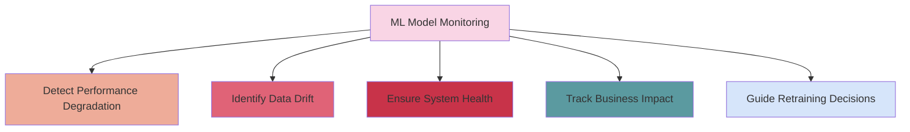
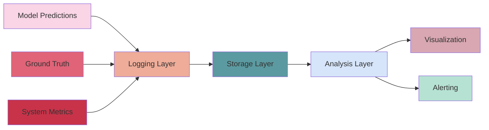
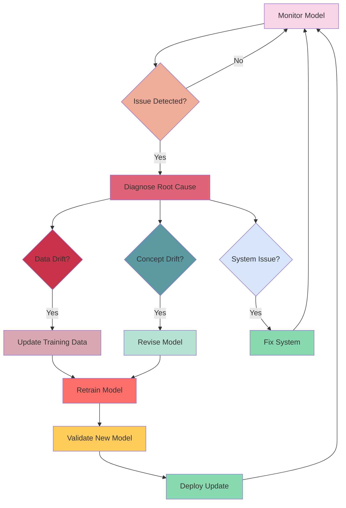

# 📊 ML Model Monitoring

Effective monitoring is critical for maintaining ML systems in production. This document outlines key monitoring strategies specific to ML models.

## 🔍 Why Monitor ML Models?

## 📋 What to Monitor

### 🧠 Model Performance Metrics

| Model Type | Key Metrics | Monitoring Frequency |
|------------|-------------|----------------------|
| Classification | Accuracy, Precision, Recall, F1 | Daily/Weekly |
| Regression | RMSE, MAE, R² | Daily/Weekly |
| Ranking | NDCG, MRR, MAP | Daily/Weekly |
| NLP | BLEU, ROUGE, Perplexity | Daily/Weekly |
| Recommendation | CTR, Conversion Rate | Real-time/Daily |

### 🔄 Data Drift Metrics

**Input Drift**: Changes in the distribution of input features
- Feature statistics (mean, median, variance)
- Distribution tests (KS test, Chi-squared)
- Population Stability Index (PSI)

**Concept Drift**: Changes in the relationship between inputs and outputs
- Model error rates over time
- Prediction distribution changes
- Feature importance shifts

### 📊 Operational Metrics

- Inference latency (p50, p95, p99)
- Throughput (requests per second)
- Error rates and types
- Resource utilization (CPU, memory, GPU)
- Cache hit rates

### 💼 Business Metrics

- Revenue impact
- User engagement
- Cost savings
- Customer satisfaction
- Domain-specific KPIs

## 🛠️ Monitoring Implementation

### 📊 Monitoring Architecture

### 🔍 Monitoring Approaches

**Online Monitoring**: Real-time tracking of model performance
- Log predictions and features
- Calculate metrics in near real-time
- Set up alerting for immediate issues

**Offline Monitoring**: Batch analysis of model performance
- Collect ground truth data
- Perform periodic evaluations
- Conduct in-depth drift analysis

**Shadow Monitoring**: Compare model versions without affecting users
- Run new models in parallel
- Compare performance metrics
- Evaluate before full deployment

## ⚠️ Setting Up Alerts

### 🚨 Alert Types

| Alert Type | Description | Example |
|------------|-------------|---------|
| Threshold-based | Alert when metrics cross predefined thresholds | Accuracy drops below 90% |
| Statistical | Alert on statistical anomalies | Unusual spike in error rates |
| Trend-based | Alert on concerning trends over time | Steadily increasing latency |
| Comparative | Alert when metrics differ significantly from baseline | 10% drop in precision from baseline |

### 📋 Alert Prioritization

**Critical Alerts**: Require immediate attention
- Model completely failing
- Severe performance degradation
- Security incidents

**Warning Alerts**: Require investigation but not immediate action
- Gradual drift detection
- Minor performance degradation
- Resource utilization concerns

**Informational Alerts**: Provide context but don't require action
- Retraining completed
- New data available
- Routine performance reports

## 🔄 Monitoring Feedback Loop

## 📝 Monitoring Best Practices

1. **Start Simple**: Begin with key metrics before adding complexity
2. **Establish Baselines**: Define normal behavior for comparison
3. **Automate Where Possible**: Reduce manual monitoring tasks
4. **Layer Your Monitoring**: Monitor at data, model, and business levels
5. **Set Meaningful Thresholds**: Avoid alert fatigue with proper settings
6. **Document Everything**: Keep records of monitoring decisions
7. **Enable Root Cause Analysis**: Collect enough data to diagnose issues
8. **Close the Feedback Loop**: Use monitoring insights to improve models

## 🛠️ Tools for ML Monitoring

| Category | Tools | Use Cases |
|----------|-------|-----------|
| Open Source | Prometheus, Grafana, Evidently AI | General metrics, ML-specific monitoring |
| Cloud Provider | AWS CloudWatch, GCP Monitoring, Azure Monitor | Cloud-based ML services |
| ML-specific | WhyLabs, Arize, Fiddler | Specialized ML monitoring |
| Data Quality | Great Expectations, Deequ | Data validation and quality |
| Visualization | Kibana, Tableau, Power BI | Custom monitoring dashboards |

## 📋 Implementation Checklist

- [ ] Define key metrics for your specific ML use case
- [ ] Set up logging for model inputs, outputs, and metadata
- [ ] Establish performance baselines
- [ ] Implement drift detection
- [ ] Create monitoring dashboards
- [ ] Configure appropriate alerts
- [ ] Document monitoring procedures
- [ ] Train team on monitoring tools and processes 