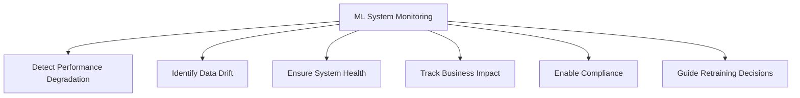
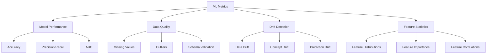
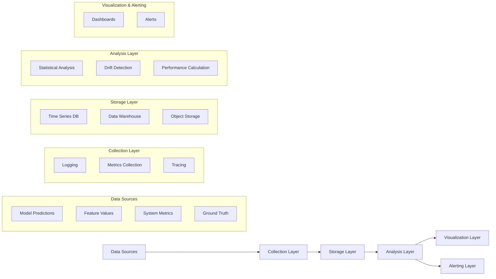
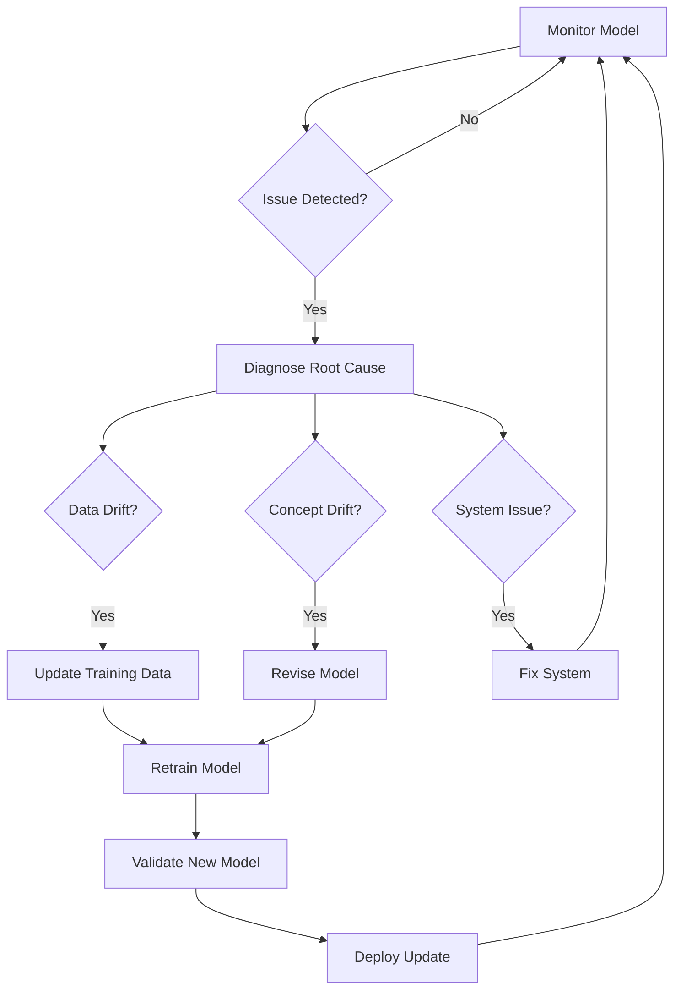
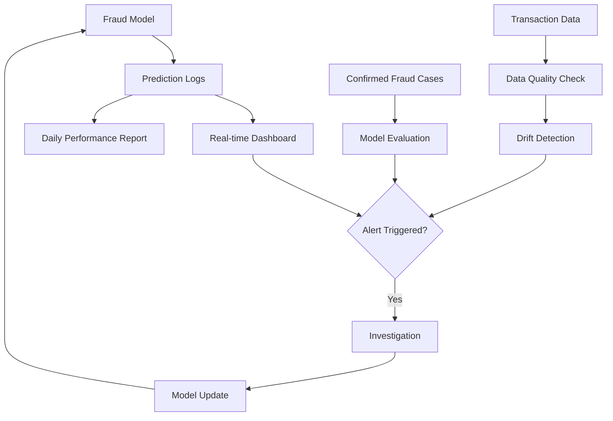
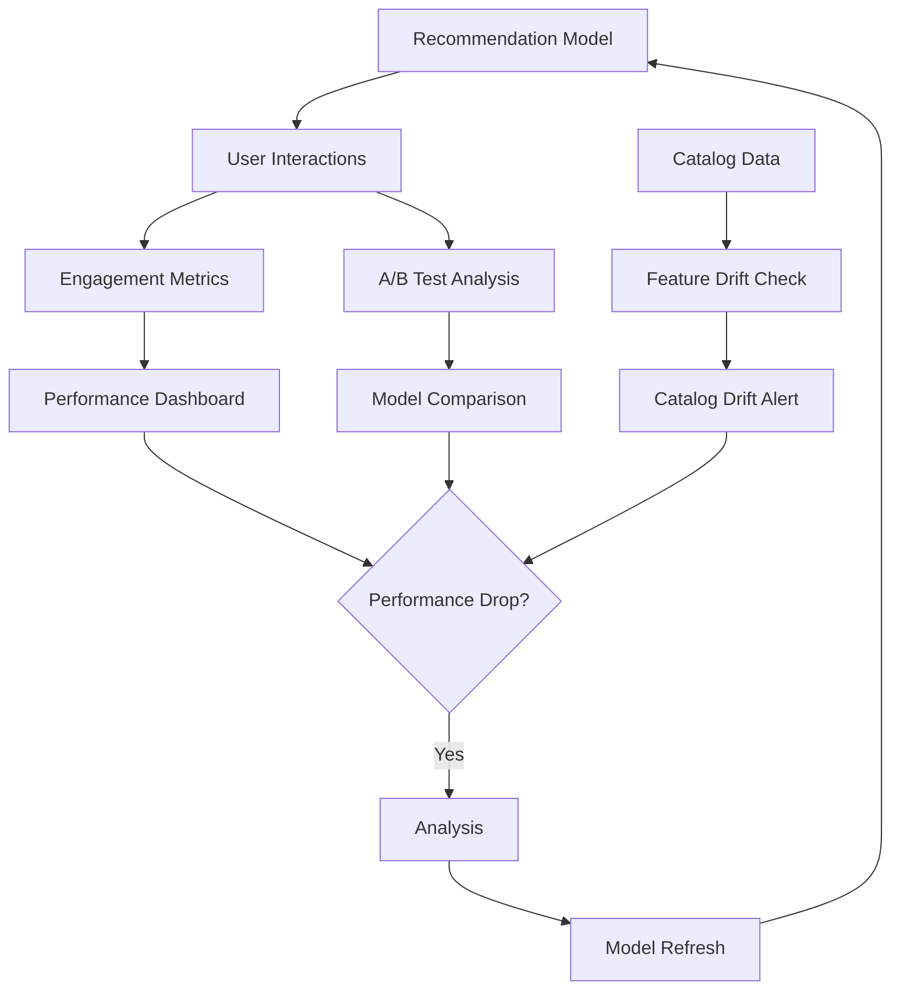

# 📊 ML Monitoring Overview

Effective monitoring is critical for maintaining ML systems in production. This document outlines key monitoring strategies and best practices for ML systems.

## 🔍 Why Monitor ML Systems?

Unlike traditional software, ML systems face unique monitoring challenges:

1. 📈 **Model Performance Decay**: Models degrade over time as data patterns change
2. 🔄 **Data Drift**: Input data distributions shift from training data
3. 🎯 **Concept Drift**: The relationship between inputs and outputs changes
4. 🧩 **Complex Dependencies**: ML systems depend on data, models, and infrastructure
5. 📊 **Business Impact**: Need to track how model decisions affect business metrics

## 📋 What to Monitor in ML Systems

### 🖥️ Operational Metrics

| Metric Type | Examples | Why It Matters |
|-------------|----------|----------------|
| **System Health** | CPU/Memory usage, Disk I/O | Ensures infrastructure can handle load |
| **Latency** | Inference time, End-to-end response time | Affects user experience |
| **Throughput** | Requests per second, Batch size | Indicates system capacity |
| **Error Rates** | Failed predictions, Timeouts | Highlights system reliability issues |
| **Resource Utilization** | GPU usage, Database connections | Helps optimize costs |

### 🧠 ML-Specific Metrics

#### 📊 Model Performance Metrics

- **Classification**: Accuracy, Precision, Recall, F1-score, AUC-ROC
- **Regression**: RMSE, MAE, R-squared
- **Ranking**: NDCG, MRR, MAP
- **NLP**: BLEU, ROUGE, Perplexity
- **Custom Metrics**: Business-specific KPIs

#### 🔍 Data Quality Metrics

- **Completeness**: Missing values, Empty fields
- **Validity**: Data type correctness, Range checks
- **Consistency**: Logical relationships between fields
- **Uniqueness**: Duplicate detection
- **Timeliness**: Data freshness

#### 🔄 Drift Metrics

- **Statistical Tests**: KS test, Chi-squared test, PSI
- **Distribution Metrics**: JS divergence, KL divergence
- **Prediction Distribution**: Changes in output distributions
- **Feature Importance Shift**: Changes in feature relevance

### 📈 Business Impact Metrics

- **Revenue Impact**: How model decisions affect revenue
- **User Engagement**: Changes in user behavior
- **Operational Efficiency**: Cost savings, process improvements
- **Customer Satisfaction**: NPS, CSAT scores
- **Business KPIs**: Domain-specific success metrics

## 🛠️ ML Monitoring Architecture

### 📥 Data Collection

**Key Components:**
- 📝 **Logging**: Structured logs for model inputs, outputs, and metadata
- 📊 **Metrics Collection**: Time-series metrics for performance and health
- 🔍 **Tracing**: Request tracing for end-to-end visibility
- 📁 **Ground Truth Collection**: Mechanisms to capture actual outcomes

**Implementation Approaches:**
- **Online Logging**: Real-time logging of predictions and features
- **Batch Extraction**: Periodic extraction of data for analysis
- **Shadow Mode**: Parallel monitoring without affecting production
- **Sampling**: Monitoring a subset of requests for efficiency

### 📊 Metrics Storage

**Storage Options:**
- **Time Series Databases**: Prometheus, InfluxDB, Timestream
- **Data Warehouses**: Snowflake, BigQuery, Redshift
- **Object Storage**: S3, GCS, Azure Blob Storage
- **Specialized ML Monitoring Stores**: Specialized solutions for ML metrics

**Considerations:**
- 📈 **Scalability**: Ability to handle high volumes of metrics
- 🔍 **Query Performance**: Fast retrieval for analysis and dashboards
- 💰 **Cost Efficiency**: Optimized storage for different data types
- 🔒 **Data Retention**: Policies for how long to keep monitoring data

### 📈 Analysis & Visualization

**Analysis Capabilities:**
- 📊 **Statistical Analysis**: Detect anomalies and patterns
- 🔄 **Drift Detection**: Identify data and concept drift
- 📉 **Performance Tracking**: Calculate and track model metrics
- 🔍 **Root Cause Analysis**: Identify sources of issues

**Visualization Options:**
- **Dashboards**: Grafana, Tableau, Power BI
- **Notebooks**: Jupyter, Colab
- **ML-specific Platforms**: Weights & Biases, Neptune, MLflow

### ⚠️ Alerting & Notification

**Alert Types:**
- 🚨 **Threshold-based**: Alert when metrics cross predefined thresholds
- 📊 **Statistical**: Alert on statistical anomalies
- 🔄 **Trend-based**: Alert on concerning trends over time
- 🧠 **ML-based**: Use ML to detect complex alert conditions

**Notification Channels:**
- 📧 **Email**: For non-urgent notifications
- 💬 **Chat**: Slack, Teams for team awareness
- 📱 **SMS/Phone**: For critical issues
- 🔄 **Ticketing Systems**: JIRA, ServiceNow for tracking

## 🔄 Monitoring Feedback Loop

**Key Steps:**
1. 📊 **Continuous Monitoring**: Track metrics in real-time or near-real-time
2. 🔍 **Issue Detection**: Identify performance degradation or anomalies
3. 🧪 **Root Cause Analysis**: Determine the source of the issue
4. 🔄 **Corrective Action**: Update data, retrain model, or fix system
5. 🚀 **Deployment**: Deploy updates to address the issue
6. 📈 **Verification**: Confirm the issue is resolved

## 🛠️ ML Monitoring Tools

| Category | Tools | Key Features |
|----------|-------|--------------|
| **General Monitoring** | Prometheus, Grafana, Datadog | System metrics, dashboards, alerting |
| **ML-specific Monitoring** | Evidently AI, WhyLabs, Arize | Drift detection, model performance |
| **Feature Monitoring** | Great Expectations, Feast | Data quality, feature validation |
| **Log Management** | ELK Stack, Loki, CloudWatch | Log collection, search, analysis |
| **Tracing** | Jaeger, Zipkin, X-Ray | Request tracing, latency analysis |
| **All-in-one ML Platforms** | SageMaker Model Monitor, Vertex AI | Integrated monitoring solutions |

## 📋 Monitoring Implementation Strategies

### 🚀 Getting Started

1. 🎯 **Start with Key Metrics**: Begin with the most critical metrics
   - Model performance (accuracy, precision, etc.)
   - Prediction distributions
   - System health (latency, errors)

2. 📊 **Establish Baselines**: Determine normal behavior
   - Collect metrics during initial deployment
   - Set appropriate thresholds
   - Document expected ranges

3. 🔄 **Implement Gradual Monitoring**: Add complexity over time
   - Start with basic dashboards
   - Add alerts for critical issues
   - Gradually implement drift detection

### 🏗️ Advanced Implementation

1. 🔄 **Automated Monitoring Pipelines**: Create automated workflows
   - Scheduled data quality checks
   - Periodic model evaluation
   - Automated drift detection

2. 📊 **Multi-level Monitoring**: Monitor at different levels
   - Raw data level
   - Feature level
   - Model level
   - Business impact level

3. 🧪 **A/B Testing Integration**: Compare model versions
   - Monitor performance differences
   - Track business metrics across versions
   - Make data-driven deployment decisions

## 📝 Best Practices for ML Monitoring

1. 🎯 **Monitor What Matters**: Focus on metrics that drive decisions
2. 🔄 **Automate Where Possible**: Reduce manual monitoring tasks
3. 📊 **Visualize Effectively**: Create clear, actionable dashboards
4. ⚠️ **Set Meaningful Alerts**: Avoid alert fatigue with proper thresholds
5. 📝 **Document Everything**: Keep records of monitoring decisions
6. 🔍 **Enable Root Cause Analysis**: Collect enough data to diagnose issues
7. 🔄 **Close the Feedback Loop**: Use monitoring insights to improve models
8. 🧪 **Test Monitoring Systems**: Ensure monitoring itself is reliable

## 🔒 Monitoring Challenges & Solutions

| Challenge | Solution |
|-----------|----------|
| **High Data Volume** | Implement sampling, aggregation, and efficient storage |
| **Ground Truth Delay** | Use proxy metrics and staged evaluation |
| **Complex Dependencies** | Implement distributed tracing and service maps |
| **Privacy Concerns** | Apply anonymization and access controls |
| **Resource Constraints** | Optimize monitoring resource usage and costs |
| **Alert Fatigue** | Tune thresholds and implement smart alerting |

## 🌟 Real-world Examples

### 🏦 Fraud Detection System

**Key Monitoring Elements:**
- 📊 **Real-time Metrics**: False positive rate, detection rate
- 🔍 **Daily Evaluation**: Performance with confirmed cases
- 🔄 **Weekly Drift Analysis**: Check for changing fraud patterns
- 📈 **Business Impact**: Fraud losses, customer friction

### 🛒 Recommendation System

**Key Monitoring Elements:**
- 👆 **Click-through Rate**: Immediate engagement
- 🛒 **Conversion Rate**: Purchase from recommendations
- 📊 **User Satisfaction**: Explicit and implicit feedback
- 🔄 **Catalog Coverage**: Diversity of recommendations

In the next section, we'll explore specific techniques for detecting and addressing data drift in ML systems. 