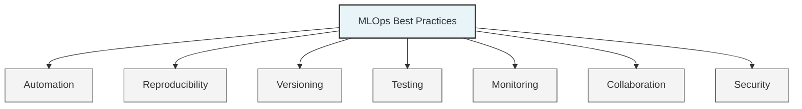

# 🌟 MLOps Best Practices

This document outlines key best practices for implementing MLOps in your organization, focusing on practical advice that can be applied immediately.

## 🎯 Core MLOps Principles

## 📝 Organizational Best Practices

### 👥 Team Structure & Collaboration

**Key Practices:**
- 🤝 Create cross-functional teams with data scientists, engineers, and domain experts
- 📊 Align on common success metrics across teams
- 📝 Establish a documentation culture from the start
- 🔄 Hold regular knowledge sharing sessions
- 🧩 Define clear ownership for each ML system component

**Implementation Tips:**
- Use collaborative tools for experiment tracking and model development
- Create shared documentation systems (wikis, knowledge bases)
- Establish regular model review sessions
- Define clear handoff procedures between teams

## 🏗️ Technical Best Practices

### 📊 Data Management

**Key Practices:**
- 📝 Version all datasets used for training and evaluation
- 🔍 Implement automated data quality checks
- 📊 Maintain data dictionaries and lineage information
- 🧩 Consider a feature store for complex feature engineering
- 🔒 Implement proper data access controls and privacy measures

**Implementation Tips:**
- Use tools like DVC or Git LFS for data versioning
- Create automated data profiling reports
- Document data sources, transformations, and usage

### 🧪 Model Development

**Key Practices:**
- 📝 Track all experiments with parameters and results
- 🔄 Use containers or environment managers for reproducibility
- 📊 Standardize evaluation metrics and procedures
- 🧩 Create reusable components for common tasks
- 📝 Document model architecture, assumptions, and limitations

**Implementation Tips:**
- Use MLflow, Weights & Biases, or similar tools for experiment tracking
- Create standardized evaluation scripts
- Build model cards for each production model

### 🚀 Deployment & Operations

**Key Practices:**
- 📦 Package models with all dependencies
- 🔄 Implement CI/CD pipelines for model deployment
- 🧪 Test thoroughly before deployment
- 📡 Monitor model performance in production
- 🔄 Establish clear rollback procedures

**Implementation Tips:**
- Use Docker containers for model serving
- Implement canary or blue/green deployment strategies
- Create automated test suites for ML components
- Set up comprehensive monitoring dashboards

## 🚀 Implementation Strategies

### 🌱 Starting Small

For organizations beginning their MLOps journey:

1. 🎯 **Focus on Fundamentals**: Start with version control and basic automation
2. 📊 **Standardize Evaluation**: Create consistent evaluation procedures
3. 📝 **Document Everything**: Build a culture of documentation from the start
4. 🧪 **Implement Basic Testing**: Begin with simple tests for critical components
5. 📡 **Simple Monitoring**: Set up basic monitoring for production models

### 🏗️ Scaling MLOps

For organizations looking to scale their MLOps practices:

1. 📋 **Standardize Workflows**: Create standard processes for common ML tasks
2. 🔄 **Automate Pipelines**: Build automated pipelines for training and deployment
3. 🏗️ **Create Internal Platforms**: Develop self-service tools for data scientists
4. 📊 **Implement Advanced Monitoring**: Add comprehensive monitoring and alerting
5. 🔍 **Continuous Improvement**: Regularly review and enhance MLOps practices

## 📝 Common Pitfalls to Avoid

| Pitfall | Impact | Prevention |
|---------|--------|------------|
| **Over-engineering** | Wasted resources, complexity | Start simple, add complexity as needed |
| **Ignoring Technical Debt** | Maintenance burden, reliability issues | Regular refactoring, documentation |
| **Siloed Teams** | Communication gaps, inefficiency | Cross-functional teams, shared goals |
| **Manual Processes** | Errors, slow deployment | Automation, standardization |
| **Inadequate Monitoring** | Undetected issues, performance degradation | Comprehensive monitoring strategy |
| **Neglecting Documentation** | Knowledge loss, onboarding difficulties | Documentation culture, templates |
| **Tool Obsession** | Focus on tools over outcomes | Start with processes, then select tools |

## 📋 MLOps Maturity Assessment

Use this checklist to assess your organization's MLOps maturity:

### 🔄 Version Control & Reproducibility

- [ ] All code is version controlled
- [ ] Data versions are tracked
- [ ] Models are versioned in a registry
- [ ] Environments are containerized
- [ ] Experiments are tracked and reproducible

### 🚀 Automation & CI/CD

- [ ] Automated data validation
- [ ] Automated model training
- [ ] Automated model testing
- [ ] Automated deployment
- [ ] Automated monitoring

### 📊 Testing & Quality

- [ ] Unit tests for code
- [ ] Data quality tests
- [ ] Model performance tests
- [ ] Integration tests
- [ ] A/B testing framework

### 📡 Monitoring & Observability

- [ ] System health monitoring
- [ ] Model performance monitoring
- [ ] Data drift detection
- [ ] Business impact tracking
- [ ] Alerting and incident response

### 🔒 Security & Governance

- [ ] Access control for ML systems
- [ ] Data privacy measures
- [ ] Model governance framework
- [ ] Audit trails
- [ ] Compliance documentation

## 🌟 Success Stories

### 🏦 Financial Institution

**Challenge**: Slow model deployment (6+ months) and inconsistent performance

**Solution**:
- Implemented standardized ML pipelines
- Created a model registry with approval workflows
- Automated testing and deployment
- Established comprehensive monitoring

**Results**:
- Reduced deployment time to 2 weeks
- Improved model performance by 15%
- Enhanced regulatory compliance
- Enabled rapid response to market changes

### 🛒 E-commerce Company

**Challenge**: Difficulty scaling recommendation systems and detecting issues

**Solution**:
- Built a feature store for recommendation features
- Implemented automated A/B testing
- Created real-time monitoring dashboards
- Established automated retraining pipelines

**Results**:
- 3x increase in models in production
- 20% improvement in recommendation relevance
- Early detection of performance issues
- Reduced computational costs by 30% 