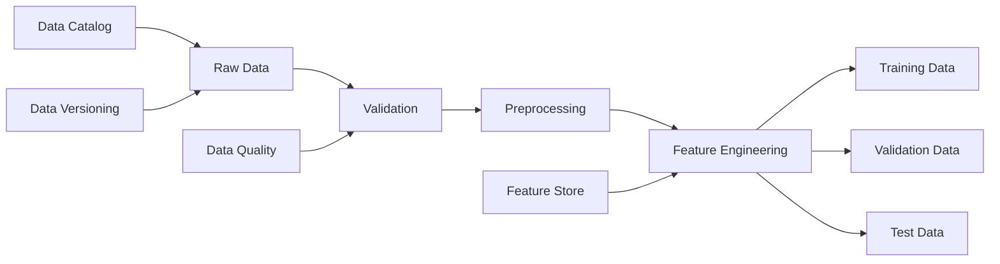
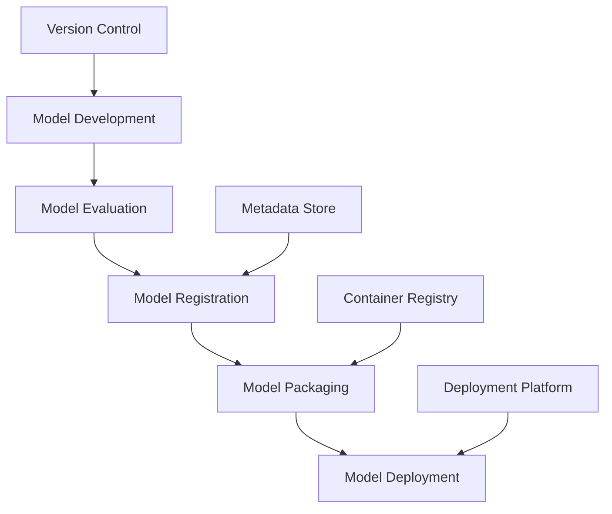
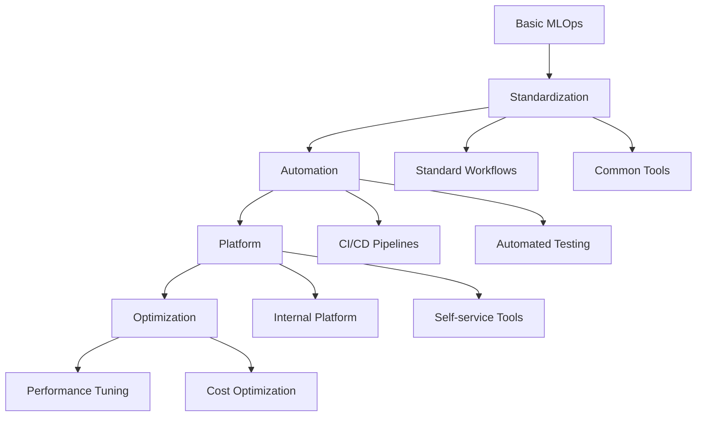

```mermaid
graph TD
    A[MLOps Best Practices] --> B[Automation]
    A --> C[Reproducibility]
    A --> D[Versioning]
    A --> E[Testing]
    A --> F[Monitoring]
    A --> G[Collaboration]
    A --> H[Security]
    
    B --> B1[Automate Pipelines]
    B --> B2[Automate Deployment]
    
    C --> C1[Reproducible Environments]
    C --> C2[Reproducible Results]
    
    D --> D1[Code Versioning]
    D --> D2[Data Versioning]
    D --> D3[Model Versioning]
    
    E --> E1[Unit Testing]
    E --> E2[Integration Testing]
    E --> E3[Model Testing]
    
    F --> F1[Performance Monitoring]
    F --> F2[Drift Detection]
    
    G --> G1[Cross-functional Teams]
    G --> G2[Knowledge Sharing]
    
    H --> H1[Access Control]
    H --> H2[Data Protection]
```

# 🌟 MLOps Best Practices

This document outlines key best practices for implementing MLOps in your organization, helping you build reliable, scalable, and maintainable machine learning systems.

## 🎯 Core MLOps Principles

## 📝 Organizational Best Practices

### 👥 Team Structure & Collaboration

**Key Practices:**
- 🤝 **Cross-functional Teams**: Combine data scientists, engineers, and domain experts
- 📊 **Shared Metrics**: Align on common success metrics across teams
- 📝 **Documentation Culture**: Document decisions, architectures, and processes
- 🔄 **Regular Knowledge Sharing**: Host sessions to share learnings and challenges
- 🧩 **Clear Ownership**: Define responsibilities for each ML system component

**Implementation Tips:**
- Create ML working groups with representatives from different teams
- Implement shared documentation systems (wikis, knowledge bases)
- Establish regular model review sessions
- Use collaborative tools for experiment tracking and model development

### 🎓 Skills & Training

**Key Practices:**
- 📚 **Continuous Learning**: Encourage ongoing education in ML and MLOps
- 🧠 **Cross-skilling**: Help team members develop skills across disciplines
- 🏆 **Recognize MLOps Excellence**: Reward good MLOps practices
- 🧪 **Hands-on Training**: Provide practical MLOps training opportunities
- 🔍 **External Expertise**: Bring in outside knowledge when needed

**Implementation Tips:**
- Create an MLOps learning path for different roles
- Organize internal workshops and hackathons
- Establish an MLOps community of practice
- Provide access to courses and certifications

## 🏗️ Technical Best Practices

### 📊 Data Management

**Key Practices:**
- 📝 **Data Versioning**: Track all datasets used for training and evaluation
- 🔍 **Data Validation**: Implement automated checks for data quality
- 📊 **Data Documentation**: Maintain data dictionaries and lineage information
- 🧩 **Feature Store**: Centralize feature computation and serving
- 🔒 **Data Governance**: Implement proper access controls and privacy measures

**Implementation Tips:**
- Use tools like DVC or LakeFS for data versioning
- Implement Great Expectations or TensorFlow Data Validation for data quality
- Create automated data profiling reports
- Consider a feature store for complex feature engineering

### 🧪 Experimentation & Model Development

**Key Practices:**
- 📝 **Experiment Tracking**: Record all experiments with parameters and results
- 🔄 **Reproducible Environments**: Use containers or environment managers
- 📊 **Standardized Evaluation**: Consistent metrics and evaluation procedures
- 🧩 **Modular Code**: Create reusable components for common tasks
- 📝 **Model Documentation**: Document model architecture, assumptions, and limitations

**Implementation Tips:**
- Use MLflow, Weights & Biases, or similar tools for experiment tracking
- Implement Docker containers for consistent environments
- Create standardized evaluation scripts
- Build model cards for each production model

### 📦 Model Packaging & Versioning

**Key Practices:**
- 📝 **Semantic Versioning**: Use clear versioning schemes for models
- 📦 **Self-contained Artifacts**: Package models with all dependencies
- 🏷️ **Rich Metadata**: Store comprehensive information about each model
- 🔄 **Immutable Models**: Treat deployed models as immutable artifacts
- 📊 **Model Registry**: Maintain a central repository of models

**Implementation Tips:**
- Use MLflow Models, ONNX, or similar formats for model packaging
- Implement Docker containers for model serving
- Store model artifacts in a versioned repository
- Use a model registry like MLflow, SageMaker Model Registry, or Vertex AI Model Registry

### 🚀 CI/CD for ML

**Key Practices:**
- 🧪 **Automated Testing**: Test code, data, and models
- 🔄 **Continuous Integration**: Automatically build and test changes
- 🚀 **Continuous Delivery**: Automate the deployment process
- 🔍 **Validation Gates**: Define criteria for promoting models to production
- 📝 **Deployment Tracking**: Record all deployments and their outcomes

**Implementation Tips:**
- Implement GitHub Actions, Jenkins, or similar CI/CD tools
- Create automated test suites for ML components
- Define clear acceptance criteria for model deployment
- Use canary or blue/green deployment strategies

### 📡 Monitoring & Observability

**Key Practices:**
- 📊 **Comprehensive Monitoring**: Track system, model, and business metrics
- 🔍 **Drift Detection**: Monitor for data and concept drift
- 📝 **Detailed Logging**: Implement structured logging for ML systems
- ⚠️ **Alerting**: Set up appropriate alerts for critical issues
- 🔄 **Feedback Loops**: Collect ground truth data for ongoing evaluation

**Implementation Tips:**
- Implement Prometheus, Grafana, or similar tools for monitoring
- Use specialized ML monitoring tools for drift detection
- Create comprehensive dashboards for different stakeholders
- Establish clear incident response procedures

### 🔒 Security & Compliance

**Key Practices:**
- 🔒 **Access Control**: Implement proper authentication and authorization
- 🔐 **Data Protection**: Encrypt sensitive data at rest and in transit
- 📝 **Audit Trails**: Maintain records of all system access and changes
- 🔍 **Vulnerability Management**: Regularly scan for and address vulnerabilities
- 📋 **Compliance Checks**: Ensure adherence to relevant regulations

**Implementation Tips:**
- Implement role-based access control for ML systems
- Use secrets management for sensitive credentials
- Create automated compliance checks
- Conduct regular security reviews

## 🚀 Implementation Strategies

### 🌱 Starting Small

For organizations beginning their MLOps journey:

1. 🎯 **Focus on Fundamentals**: Start with version control and basic automation
2. 📊 **Standardize Evaluation**: Create consistent evaluation procedures
3. 📝 **Document Everything**: Build a culture of documentation from the start
4. 🧪 **Implement Basic Testing**: Begin with simple tests for critical components
5. 📡 **Simple Monitoring**: Set up basic monitoring for production models

### 🏗️ Scaling MLOps

For organizations looking to scale their MLOps practices:

1. 📋 **Standardize Workflows**: Create standard processes for common ML tasks
2. 🔄 **Automate Pipelines**: Build automated pipelines for training and deployment
3. 🏗️ **Create Internal Platforms**: Develop self-service tools for data scientists
4. 📊 **Implement Advanced Monitoring**: Add comprehensive monitoring and alerting
5. 🔍 **Continuous Improvement**: Regularly review and enhance MLOps practices

### 🌟 Enterprise MLOps

For large organizations with mature ML practices:

1. 🏗️ **MLOps Platform**: Build or adopt a comprehensive MLOps platform
2. 🔄 **Automated Governance**: Implement automated compliance and governance
3. 📊 **Advanced Observability**: Create sophisticated monitoring and observability
4. 🧩 **Reusable Components**: Develop a library of reusable ML components
5. 🔍 **Optimization**: Continuously optimize for performance, cost, and quality

## 📋 MLOps Maturity Assessment

Use this checklist to assess your organization's MLOps maturity:

### 🔄 Version Control & Reproducibility

- [ ] All code is version controlled
- [ ] Data versions are tracked
- [ ] Models are versioned in a registry
- [ ] Environments are containerized
- [ ] Experiments are tracked and reproducible

### 🚀 Automation & CI/CD

- [ ] Automated data validation
- [ ] Automated model training
- [ ] Automated model testing
- [ ] Automated deployment
- [ ] Automated monitoring

### 📊 Testing & Quality

- [ ] Unit tests for code
- [ ] Data quality tests
- [ ] Model performance tests
- [ ] Integration tests
- [ ] A/B testing framework

### 📡 Monitoring & Observability

- [ ] System health monitoring
- [ ] Model performance monitoring
- [ ] Data drift detection
- [ ] Business impact tracking
- [ ] Alerting and incident response

### 🔒 Security & Governance

- [ ] Access control for ML systems
- [ ] Data privacy measures
- [ ] Model governance framework
- [ ] Audit trails
- [ ] Compliance documentation

## 🌟 Case Studies: MLOps Success Stories

### 🏦 Financial Institution

**Challenge**: Slow model deployment (6+ months) and inconsistent performance

**Solution**:
- Implemented standardized ML pipelines
- Created a model registry with approval workflows
- Automated testing and deployment
- Established comprehensive monitoring

**Results**:
- Reduced deployment time to 2 weeks
- Improved model performance by 15%
- Enhanced regulatory compliance
- Enabled rapid response to market changes

### 🛒 E-commerce Company

**Challenge**: Difficulty scaling recommendation systems and detecting issues

**Solution**:
- Built a feature store for recommendation features
- Implemented automated A/B testing
- Created real-time monitoring dashboards
- Established automated retraining pipelines

**Results**:
- 3x increase in models in production
- 20% improvement in recommendation relevance
- Early detection of performance issues
- Reduced computational costs by 30%

## 📝 Common MLOps Pitfalls to Avoid

| Pitfall | Impact | Prevention |
|---------|--------|------------|
| **Over-engineering** | Wasted resources, complexity | Start simple, add complexity as needed |
| **Ignoring Technical Debt** | Maintenance burden, reliability issues | Regular refactoring, documentation |
| **Siloed Teams** | Communication gaps, inefficiency | Cross-functional teams, shared goals |
| **Manual Processes** | Errors, slow deployment | Automation, standardization |
| **Inadequate Monitoring** | Undetected issues, performance degradation | Comprehensive monitoring strategy |
| **Neglecting Documentation** | Knowledge loss, onboarding difficulties | Documentation culture, templates |
| **Tool Obsession** | Focus on tools over outcomes | Start with processes, then select tools |

## 🔮 The Future of MLOps

As MLOps continues to evolve, watch for these emerging trends:

- 🤖 **LLMOps**: Specialized practices for large language models
- 🔄 **Continuous Learning Systems**: Models that update in real-time
- 🧩 **Composable ML**: Building systems from reusable components
- 🔒 **Responsible AI Automation**: Automated fairness and bias checks
- 🌐 **Federated MLOps**: Managing models across distributed environments
- 🏗️ **Low-Code/No-Code MLOps**: Making MLOps accessible to non-specialists

---

By implementing these MLOps best practices, organizations can build more reliable, scalable, and maintainable machine learning systems, ultimately delivering greater business value from their ML investments. 