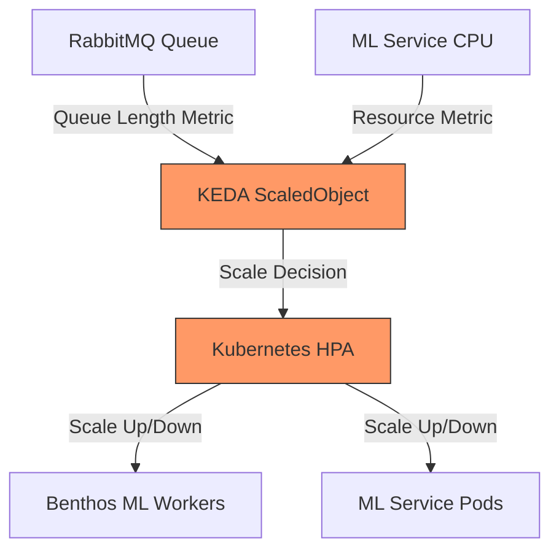
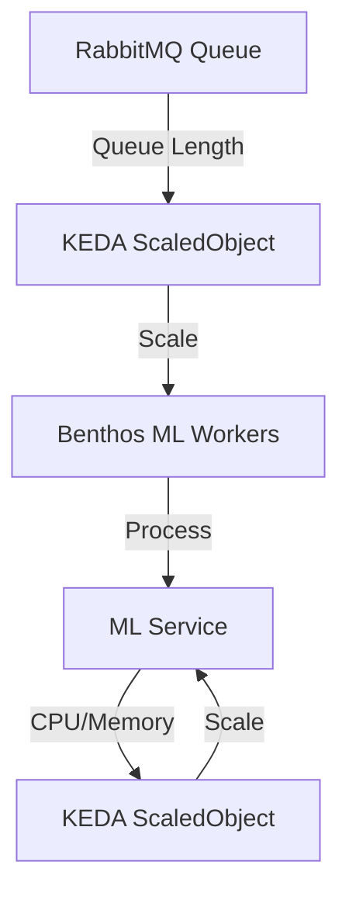

# KEDA Concepts

## What KEDA Does in Our Architecture

KEDA (Kubernetes Event-driven Autoscaling) serves as the **intelligent scaling brain** for our ML inference system, specifically:

1. **Queue-Based Autoscaling**: KEDA monitors RabbitMQ queue lengths and automatically scales Benthos ML workers up or down based on workload.

2. **Resource-Based Autoscaling**: KEDA watches CPU/memory usage of ML services and scales them to maintain optimal performance.

3. **Zero-to-Many Scaling**: KEDA scales services to zero when idle (saving costs) and rapidly scales up when traffic arrives.

All of this happens **declaratively through Kubernetes custom resources** - no custom scaling logic or monitoring code required.



## Why We Need KEDA

KEDA solves several critical problems in our ML inference architecture:

### 1. Efficient Resource Utilization
- **Cost Optimization**: Scales to zero when no inference requests are pending
- **Burst Handling**: Rapidly scales up during traffic spikes
- **Right-Sizing**: Maintains optimal worker-to-queue ratio

#### Example: Queue-Based Autoscaling

Here's how KEDA scales our Benthos ML workers based on RabbitMQ queue length:

```yaml
# KEDA ScaledObject for Benthos ML Workers
apiVersion: keda.sh/v1alpha1
kind: ScaledObject
metadata:
  name: benthos-ml-worker-scaler
  namespace: ml-inference
spec:
  scaleTargetRef:
    name: benthos-ml-worker
    kind: Deployment
  minReplicaCount: 0
  maxReplicaCount: 20
  pollingInterval: 15
  cooldownPeriod: 30
  triggers:
  - type: rabbitmq
    metadata:
      protocol: amqp
      queueName: inference_requests
      host: rabbitmq.ml-inference
      queueLength: "50"
      username: user
      value: "5"
```

This configuration:
1. Targets the `benthos-ml-worker` deployment
2. Allows scaling from 0 to 20 replicas
3. Adds 1 worker for every 50 messages in the queue
4. Checks queue length every 15 seconds
5. Waits 30 seconds after scaling before making new decisions

### 2. Eliminating Custom Scaling Logic
- **No Custom Metrics Collection**: Uses built-in scalers for RabbitMQ, Prometheus, etc.
- **No Custom Scaling Algorithms**: Uses proven scaling logic
- **No Custom Monitoring**: Leverages existing metrics

### 3. Operational Advantages
- **Declarative Configuration**: Define scaling rules as Kubernetes resources
- **Multiple Trigger Support**: Scale based on multiple metrics simultaneously
- **Scaling History**: Track scaling decisions for optimization

### 4. ML-Specific Benefits
- **Inference Latency Control**: Maintains low latency by scaling before queues grow too large
- **Batch Size Optimization**: Scales to optimal number of workers for current batch size
- **Cost-Effective GPU Utilization**: Scales GPU-based inference services efficiently

## Core Concepts

### 1. ScaledObject

The ScaledObject is the primary KEDA resource that defines:
- What to scale (Deployment, StatefulSet, etc.)
- When to scale (triggers and thresholds)
- How to scale (min/max replicas, polling intervals)

```yaml
apiVersion: keda.sh/v1alpha1
kind: ScaledObject
metadata:
  name: ml-inference-scaler
spec:
  scaleTargetRef:
    name: ml-inference-deployment
    kind: Deployment
  minReplicaCount: 1
  maxReplicaCount: 10
  triggers:
  - type: prometheus
    metadata:
      serverAddress: http://prometheus.monitoring:9090
      metricName: inference_request_duration_seconds
      threshold: "100"
      query: sum(rate(inference_request_duration_seconds_count[2m]))
```

### 2. ScaledJob

For batch processing of ML inference requests:

```yaml
apiVersion: keda.sh/v1alpha1
kind: ScaledJob
metadata:
  name: batch-inference-job
spec:
  jobTargetRef:
    template:
      spec:
        containers:
        - name: batch-processor
          image: ml-batch-processor:latest
  triggers:
  - type: rabbitmq
    metadata:
      queueName: batch_inference_requests
      queueLength: "100"
```

### 3. Triggers

KEDA supports multiple trigger types relevant to ML workloads:

#### RabbitMQ Trigger
```yaml
triggers:
- type: rabbitmq
  metadata:
    protocol: amqp
    queueName: inference_requests
    host: rabbitmq.ml-inference
    queueLength: "50"
```

#### Prometheus Trigger
```yaml
triggers:
- type: prometheus
  metadata:
    serverAddress: http://prometheus.monitoring:9090
    metricName: model_inference_time
    threshold: "100"
    query: avg(model_inference_time{model="gpt4"})
```

#### CPU/Memory Trigger
```yaml
triggers:
- type: cpu
  metadata:
    type: Utilization
    value: "70"
```

## Implementation Patterns

### 1. Multi-Stage Scaling Pattern



This pattern:
1. Scales Benthos workers based on queue length
2. Independently scales ML services based on resource utilization
3. Ensures both components scale proportionally to demand

### 2. Predictive Scaling Pattern

```yaml
apiVersion: keda.sh/v1alpha1
kind: ScaledObject
metadata:
  name: predictive-ml-scaler
spec:
  scaleTargetRef:
    name: ml-inference-deployment
  triggers:
  - type: prometheus
    metadata:
      serverAddress: http://prometheus.monitoring:9090
      query: predict_linear(rabbitmq_queue_messages[30m], 600)
      threshold: "100"
```

This pattern:
1. Uses Prometheus prediction functions
2. Scales based on predicted queue length in the next 10 minutes
3. Proactively adds capacity before it's needed

### 3. Cost-Optimization Pattern

```yaml
apiVersion: keda.sh/v1alpha1
kind: ScaledObject
metadata:
  name: cost-optimized-ml-scaler
spec:
  scaleTargetRef:
    name: ml-inference-deployment
  minReplicaCount: 0
  idleReplicaCount: 0
  fallback:
    failureThreshold: 3
    replicas: 1
  triggers:
  - type: rabbitmq
    metadata:
      queueName: inference_requests
      queueLength: "1"
```

This pattern:
1. Scales to zero when no requests are pending
2. Maintains a fallback replica if scaling fails
3. Immediately scales up when any request arrives

## Advanced Concepts

### 1. Scaling Profiles

Different scaling profiles for different ML models:

```yaml
# High-Performance Model Scaling
apiVersion: keda.sh/v1alpha1
kind: ScaledObject
metadata:
  name: gpt4-model-scaler
spec:
  scaleTargetRef:
    name: gpt4-inference
  minReplicaCount: 2  # Always keep some capacity
  maxReplicaCount: 10
  triggers:
  - type: rabbitmq
    metadata:
      queueName: gpt4_requests
      queueLength: "10"  # Scale aggressively

---
# Cost-Efficient Model Scaling
apiVersion: keda.sh/v1alpha1
kind: ScaledObject
metadata:
  name: bert-model-scaler
spec:
  scaleTargetRef:
    name: bert-inference
  minReplicaCount: 0  # Scale to zero when idle
  maxReplicaCount: 20
  triggers:
  - type: rabbitmq
    metadata:
      queueName: bert_requests
      queueLength: "50"  # Scale conservatively
```

### 2. Compound Triggers

Scale based on multiple metrics:

```yaml
apiVersion: keda.sh/v1alpha1
kind: ScaledObject
metadata:
  name: compound-ml-scaler
spec:
  scaleTargetRef:
    name: ml-inference-deployment
  triggers:
  - type: rabbitmq
    metadata:
      queueName: inference_requests
      queueLength: "50"
  - type: prometheus
    metadata:
      query: avg(rate(inference_latency_seconds[2m]))
      threshold: "0.5"
  - type: cpu
    metadata:
      value: "70"
```

This configuration scales based on:
1. Queue length
2. Inference latency
3. CPU utilization
Whichever metric requires the most replicas determines the scaling decision.

### 3. Scaling Stabilization

Prevent scaling thrashing:

```yaml
apiVersion: keda.sh/v1alpha1
kind: ScaledObject
metadata:
  name: stable-ml-scaler
spec:
  scaleTargetRef:
    name: ml-inference-deployment
  advanced:
    horizontalPodAutoscalerConfig:
      behavior:
        scaleDown:
          stabilizationWindowSeconds: 300
          policies:
          - type: Percent
            value: 20
            periodSeconds: 60
        scaleUp:
          stabilizationWindowSeconds: 0
          policies:
          - type: Percent
            value: 100
            periodSeconds: 15
```

This configuration:
1. Scales up quickly (100% increase every 15 seconds)
2. Scales down slowly (20% decrease every 60 seconds)
3. Waits 5 minutes before scaling down

## Scaling Based on Token Consumption

In addition to scaling based on queue length, KEDA can scale our ML workers based on token consumption metrics, which provides a more accurate representation of actual computational load.

### Token-Based Scaling with Prometheus

```yaml
apiVersion: keda.sh/v1alpha1
kind: ScaledObject
metadata:
  name: ml-worker-token-scaler
  namespace: ml-inference
spec:
  scaleTargetRef:
    name: ml-worker-deployment
  minReplicaCount: 1
  maxReplicaCount: 20
  pollingInterval: 15
  cooldownPeriod: 30
  triggers:
    - type: prometheus
      metadata:
        serverAddress: http://prometheus-server.monitoring.svc.cluster.local:9090
        metricName: ml_tokens_per_minute
        query: sum(rate(ml_tokens_processed_total{model="gpt-3.5-turbo"}[5m])) * 60
        threshold: "5000"
```

This ScaledObject configuration:
1. Monitors the rate of tokens processed per minute via Prometheus
2. Scales when the token processing rate exceeds 5,000 tokens per minute
3. Maintains between 1 and 20 replicas based on token processing demand

### Hybrid Scaling Strategy

For optimal resource utilization, we can implement a hybrid scaling strategy that considers both queue length and token consumption:

```yaml
apiVersion: keda.sh/v1alpha1
kind: ScaledObject
metadata:
  name: ml-worker-hybrid-scaler
  namespace: ml-inference
spec:
  scaleTargetRef:
    name: ml-worker-deployment
  minReplicaCount: 1
  maxReplicaCount: 20
  pollingInterval: 15
  cooldownPeriod: 30
  triggers:
    # Scale based on queue length
    - type: rabbitmq
      metadata:
        protocol: amqp
        queueName: inference_requests
        host: rabbitmq.ml-inference.svc.cluster.local
        queueLength: "10"
    
    # Scale based on token consumption rate
    - type: prometheus
      metadata:
        serverAddress: http://prometheus-server.monitoring.svc.cluster.local:9090
        metricName: ml_tokens_per_minute
        query: sum(rate(ml_tokens_processed_total{model="gpt-3.5-turbo"}[5m])) * 60
        threshold: "5000"
```

This hybrid approach ensures that we scale:
1. When the queue builds up (indicating a backlog of requests)
2. When token consumption is high (indicating resource-intensive requests)

### Exposing Token Metrics for KEDA

To enable token-based scaling, we need to expose token consumption metrics to Prometheus. This can be done by:

1. **Instrumenting Benthos**: Configure Benthos to expose token metrics via its Prometheus endpoint:

```yaml
# Benthos ML Worker Configuration
metrics:
  prometheus:
    prefix: benthos
    push_interval: ""
    push_job_name: benthos_push
    push_url: ""
    
pipeline:
  processors:
    # Process ML request and track tokens
    - bloblang: |
        root = this
        # Extract token counts from ML service response
        root.prompt_tokens = this.usage.prompt_tokens
        root.completion_tokens = this.usage.completion_tokens
        root.total_tokens = this.usage.total_tokens
        
    # Increment token counters in Prometheus
    - metric:
        type: counter
        name: ml_tokens_processed_total
        labels:
          model: ${! this.model }
          type: "prompt"
        value: ${! this.prompt_tokens }
        
    - metric:
        type: counter
        name: ml_tokens_processed_total
        labels:
          model: ${! this.model }
          type: "completion"
        value: ${! this.completion_tokens }
```

2. **Creating a ServiceMonitor**: Set up Prometheus to scrape these metrics:

```yaml
apiVersion: monitoring.coreos.com/v1
kind: ServiceMonitor
metadata:
  name: benthos-metrics
  namespace: monitoring
spec:
  selector:
    matchLabels:
      app: benthos-ml-worker
  endpoints:
  - port: metrics
    interval: 15s
```

### Benefits of Token-Based Scaling

1. **Resource Efficiency**: Scales based on actual computational load rather than just request count
2. **Cost Optimization**: Ensures resources are allocated proportionally to workload intensity
3. **Model-Specific Scaling**: Different models can have different scaling thresholds based on their token processing capabilities
4. **Predictive Scaling**: Historical token consumption patterns can be used for predictive scaling

## Project Implementation Plan

| Component | Scaling Metric | Description |
|-----------|----------------|-------------|
| Benthos API Gateway | CPU/Memory | Scales based on incoming HTTP request load |
| Benthos ML Workers | RabbitMQ Queue Length | Scales based on number of pending inference requests |
| ML Service | Prometheus Latency Metrics | Scales based on inference latency and throughput |
| Results Collector | PostgreSQL Metrics | Scales based on result processing backlog |

## Next Steps
- [Setup Guide](./setup.md)
- [Operations Guide](./operations.md)
- [Project Architecture](../../01-architecture/overview.md) 