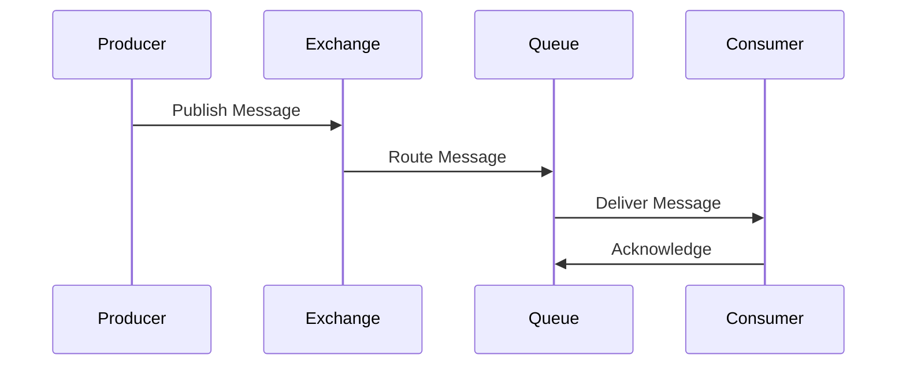
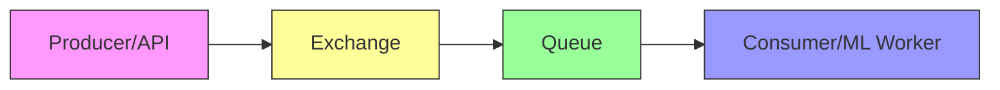
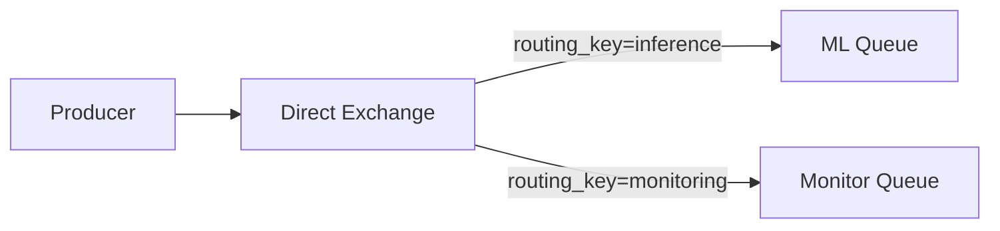
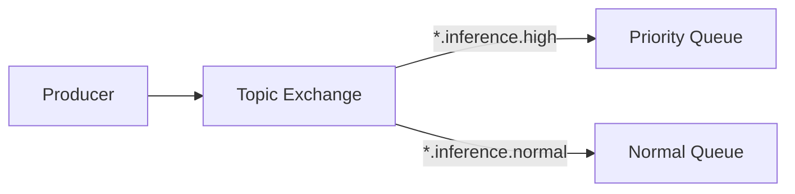
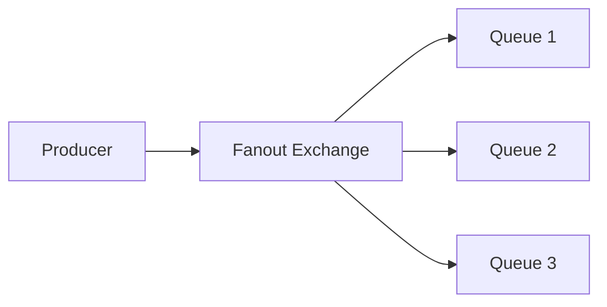
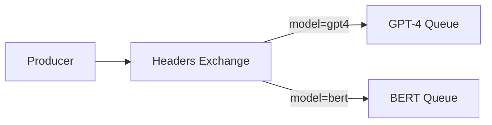
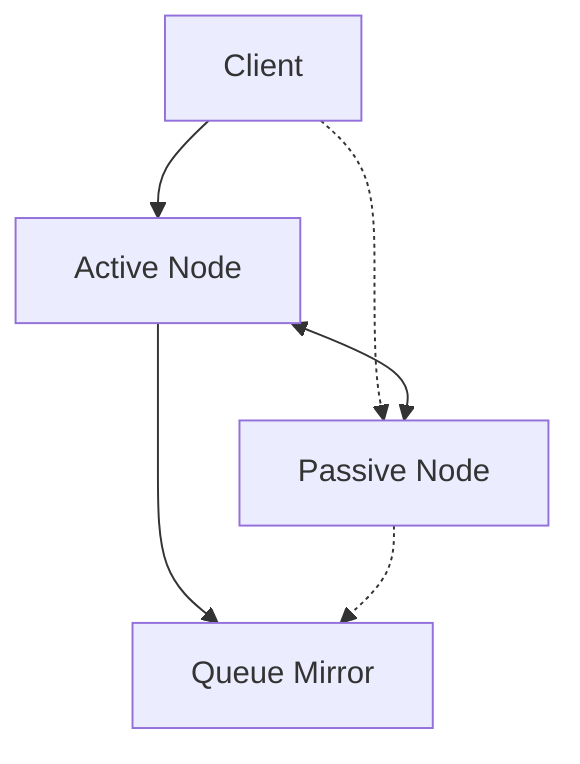
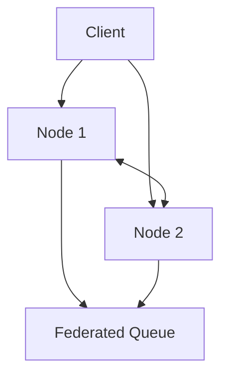

# RabbitMQ Concepts

## Introduction

### What is Message Queuing?
Message queuing enables asynchronous communication between services by:
- Buffering messages in a queue
- Ensuring reliable delivery
- Handling traffic spikes
- Providing system resilience

### Evolution of Message Queuing
1. **Traditional Communication**
   ```
   [Service A] ←→ [Service B] (Tight Coupling)
   ```
   Problems:
   - Services need to be available simultaneously
   - Direct dependencies
   - No buffer for traffic spikes

2. **Message Queue Pattern**
   ```
   [Service A] → [Queue] → [Service B] (Loose Coupling)
   ```
   Benefits:
   - Services can operate independently
   - Built-in buffer
   - Better error handling

### Why RabbitMQ for ML Inference?
1. **Decoupling**: API and ML workers operate independently
2. **Load Handling**: Buffers requests during high traffic
3. **Reliability**: Ensures no inference requests are lost
4. **Scalability**: Easy to scale workers based on queue length

## Core Concepts

### 1. AMQP Protocol
Advanced Message Queuing Protocol (AMQP) is the standardized protocol that RabbitMQ implements.

#### Key Features
- Open standard protocol
- Platform-neutral
- Wire-level protocol
- Reliable delivery
- Security features

#### Protocol Flow


### 2. Message Flow Architecture

#### Basic Flow


#### Advanced Flow with Error Handling


### 3. Exchange Types

#### Direct Exchange (Point-to-Point)

Use Case: Routing specific ML model requests

#### Topic Exchange (Pattern Matching)

Use Case: Priority-based inference routing

#### Fanout Exchange (Broadcast)

Use Case: System-wide notifications

#### Headers Exchange (Attribute-based)

Use Case: Model-specific routing

> **Note:** The following implementation patterns are for conceptual understanding. We will implement these patterns in the project itself as part of our "Asynchronous Architecture Patterns To Scale ML and Other High Latency Workloads on Kubernetes" architecture.

## Implementation Patterns

### 1. Basic Request-Response
```python
# Producer (API Service)
async def request_inference(data: dict):
    request_id = str(uuid.uuid4())
    
    # Create message with reply-to queue
    message = Message(
        body=json.dumps({
            "request_id": request_id,
            "data": data
        }).encode(),
        reply_to="responses",
        correlation_id=request_id
    )
    
    # Send and wait for response
    await exchange.publish(message, "inference")
    return request_id

# Consumer (ML Worker)
async def process_and_respond(message: Message):
    data = json.loads(message.body.decode())
    result = await ml_model.infer(data["data"])
    
    # Send response
    response = Message(
        body=json.dumps(result).encode(),
        correlation_id=message.correlation_id
    )
    await exchange.publish(
        response,
        routing_key=message.reply_to
    )
```

> **Implementation Note:** This pattern will be implemented in our project's API service and ML workers to handle inference requests.

### 2. Priority Queue Pattern
```python
# High-priority request
message = Message(
    body=data,
    priority=10,
    headers={"importance": "high"}
)

# Queue configuration
queue_args = {
    "x-max-priority": 10,
    "x-queue-mode": "lazy"
}
```

> **Implementation Note:** We'll implement priority queues to ensure critical ML inference requests are processed first.

### 3. Dead Letter Pattern
```python
# Setup
async def setup_dlx():
    # Dead letter exchange
    dlx = await channel.declare_exchange(
        "dead_letters",
        ExchangeType.TOPIC
    )
    
    # Dead letter queue
    dl_queue = await channel.declare_queue(
        "failed_requests",
        arguments={
            "x-message-ttl": 86400000,  # 24 hours
            "x-dead-letter-exchange": "retry"
        }
    )
    
    # Main queue with DLX
    main_queue = await channel.declare_queue(
        "inference_queue",
        arguments={
            "x-dead-letter-exchange": "dead_letters",
            "x-dead-letter-routing-key": "failed"
        }
    )
```

> **Implementation Note:** This pattern will be crucial for handling failed ML inference requests and implementing retry logic.

### 4. Circuit Breaker Pattern
```python
class MLCircuitBreaker:
    def __init__(self, failure_threshold=5, reset_timeout=60):
        self.failures = 0
        self.threshold = failure_threshold
        self.reset_timeout = reset_timeout
        self.last_failure = None
        self.state = "closed"
    
    async def call_service(self, message):
        if self.state == "open":
            if time.time() - self.last_failure > self.reset_timeout:
                self.state = "half-open"
            else:
                raise CircuitBreakerOpen()
        
        try:
            result = await process_ml_request(message)
            if self.state == "half-open":
                self.state = "closed"
                self.failures = 0
            return result
        except Exception as e:
            self.failures += 1
            self.last_failure = time.time()
            if self.failures >= self.threshold:
                self.state = "open"
            raise
```

> **Implementation Note:** We'll implement circuit breakers to prevent cascading failures when ML services are overloaded.

## Message Properties Deep Dive

### 1. Persistence Levels
```python
# Transient (faster, no persistence)
message = Message(
    body=data,
    delivery_mode=DeliveryMode.NOT_PERSISTENT
)

# Persistent (slower, survives restart)
message = Message(
    body=data,
    delivery_mode=DeliveryMode.PERSISTENT
)

# Persistent with additional guarantees
message = Message(
    body=data,
    delivery_mode=DeliveryMode.PERSISTENT,
    mandatory=True,  # Ensure queue exists
    immediate=False  # Don't require immediate consumer
)
```

> **Implementation Note:** We'll configure appropriate persistence levels to ensure ML inference requests aren't lost during system failures.

### 2. Message Context
```python
message = Message(
    body=data,
    content_type="application/json",
    content_encoding="utf-8",
    headers={
        "model_version": "gpt-4-0613",
        "priority_level": "high",
        "retry_count": 0
    },
    correlation_id=request_id,
    reply_to="responses",
    expiration="60000",  # 60 seconds TTL
    message_id=str(uuid.uuid4())
)
```

## Advanced Concepts

### 1. Flow Control
```python
# Producer Flow Control
class ProducerRateLimit:
    def __init__(self, max_rate=100):  # 100 msgs/sec
        self.max_rate = max_rate
        self.tokens = max_rate
        self.last_update = time.time()
    
    async def acquire(self):
        now = time.time()
        time_passed = now - self.last_update
        self.tokens = min(
            self.max_rate,
            self.tokens + time_passed * self.max_rate
        )
        
        if self.tokens < 1:
            await asyncio.sleep(1/self.max_rate)
            return await self.acquire()
        
        self.tokens -= 1
        self.last_update = now
        return True
```

> **Implementation Note:** Flow control will be essential for managing high volumes of ML inference requests.

### 2. Batch Processing
```python
async def batch_consumer(queue, batch_size=10, timeout=5):
    messages = []
    deadline = time.time() + timeout
    
    async with queue.iterator() as queue_iter:
        async for message in queue_iter:
            messages.append(message)
            
            if len(messages) >= batch_size or time.time() > deadline:
                # Process batch
                results = await process_batch(messages)
                # Acknowledge all messages
                for msg in messages:
                    await msg.ack()
                messages = []
                deadline = time.time() + timeout
```

> **Implementation Note:** We'll implement batch processing for efficient handling of multiple ML inference requests.

### 3. High Availability Patterns

#### Active-Passive


#### Active-Active


> **Implementation Note:** High availability configurations will ensure our ML inference pipeline remains operational even during node failures.

## Best Practices

### 1. Connection Management
- Use connection pools
- Handle connection failures
- Implement retry logic
- Monitor connection health

### 2. Message Design
- Keep messages small
- Include correlation IDs
- Use appropriate routing keys
- Consider message TTL
- Implement idempotency keys

### 3. Error Handling
- Implement dead letter queues
- Use proper acknowledgments
- Handle retries appropriately
- Log failed messages
- Implement circuit breakers

### 4. Performance Optimization
- Use appropriate prefetch counts
- Implement batching where suitable
- Monitor queue lengths
- Use lazy queues for large messages
- Implement back pressure handling

### 5. Security
- Use TLS for connections
- Implement proper authentication
- Use virtual hosts for isolation
- Regular credential rotation
- Implement proper access controls

## Project Implementation Plan

| Pattern | Component | Description |
|---------|-----------|-------------|
| Request-Response | API Service & ML Workers | Core pattern for handling inference requests |
| Error Handling | Queue Configuration | Dead letter exchanges and retry mechanisms |
| Priority Queues | Message Properties | Ensuring critical inference requests are processed first |
| High Availability | Infrastructure | Clustered RabbitMQ deployment on Kubernetes |
| Flow Control | Producer Configuration | Managing high volumes of inference requests |
| Circuit Breakers | Consumer Logic | Preventing cascading failures |
| Batch Processing | ML Workers | Efficient processing of multiple inference requests |
| Monitoring | Infrastructure | Prometheus/Grafana dashboards for queue metrics |

## Next Steps
- [Setup Guide](./setup.md)
- [Operations Guide](./operations.md)
- [Project Architecture](../../01-architecture/overview.md) 