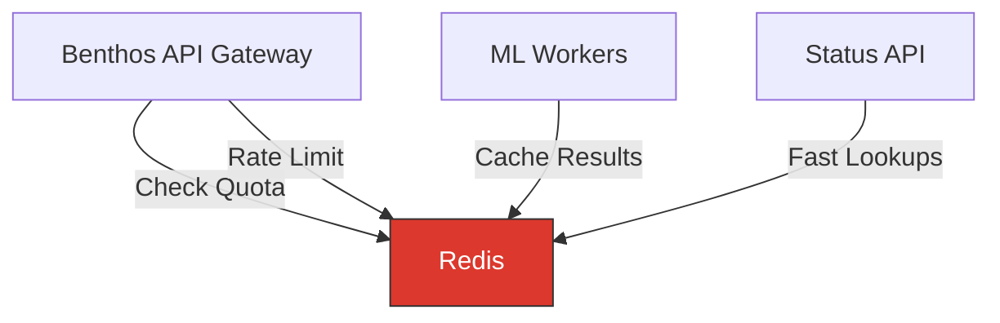
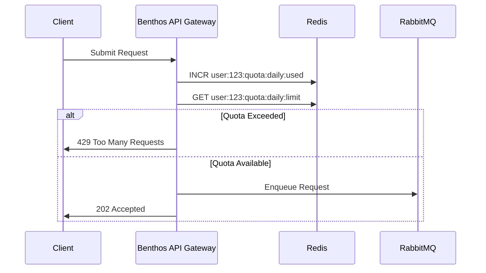
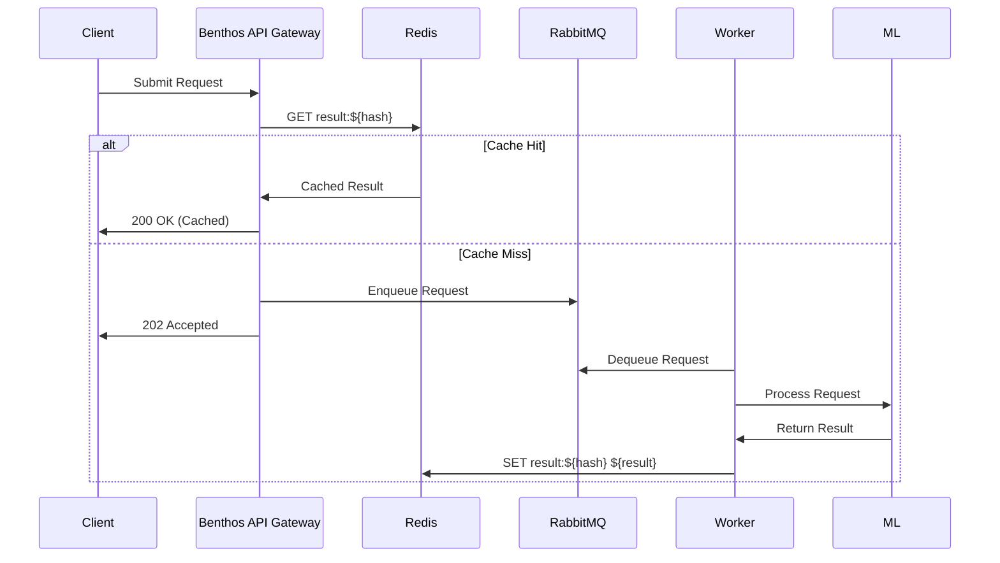
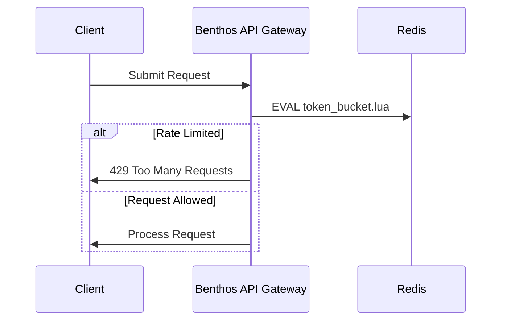

# Redis Concepts

## What Redis Does in Our Architecture

Redis serves as the **high-speed data layer** for our ML inference system, specifically:

1. **Quota Management**: Tracks and enforces user-specific API quotas in real-time
2. **Rate Limiting**: Prevents API abuse and ensures fair resource allocation
3. **Result Caching**: Stores recent inference results for fast retrieval
4. **Distributed Locking**: Coordinates distributed processes across the system



## Why We Need Redis

Redis solves several critical problems in our ML inference architecture:

### 1. Real-Time Quota Management

- **Fast Counters**: Atomic increment operations for tracking usage
- **Time-Based Expiry**: Automatic quota resets using TTL
- **Low Latency**: Sub-millisecond quota checks at request time

#### Example: User Quota Implementation

```
# Set daily quota limit (resets after 24 hours)
SET user:123:quota:daily:limit 1000
# Initialize usage counter with 24-hour expiry
SET user:123:quota:daily:used 0 EX 86400

# For each request, atomically increment and check
INCR user:123:quota:daily:used
GET user:123:quota:daily:limit
GET user:123:quota:daily:used

# If used >= limit, reject the request
```

In Benthos configuration:

```yaml
pipeline:
  processors:
    - redis:
        url: redis://redis:6379
        command: incr
        key: ${! "user:" + this.user_id + ":quota:daily:used" }
        retries: 3
    - redis:
        url: redis://redis:6379
        command: get
        key: ${! "user:" + this.user_id + ":quota:daily:limit" }
        retries: 3
    - bloblang: |
        root = this
        root.quota_used = this.redis_0
        root.quota_limit = this.redis_1
        root.quota_exceeded = this.redis_0 > this.redis_1
    - branch:
        processors:
          - bloblang: |
              root.error = "Quota exceeded"
              root.status_code = 429
        condition:
          bloblang: root.quota_exceeded
```

### 2. Intelligent Rate Limiting

- **Token Bucket Algorithm**: Sophisticated rate limiting with bursts
- **IP-Based Limiting**: Prevent abuse from specific sources
- **Service Protection**: Shield ML services from traffic spikes

#### Example: Rate Limiting Implementation

Using the Redis-based token bucket algorithm:

```
# Initialize bucket (100 tokens, refill 10 per second)
HSET ratelimit:ip:192.168.1.1 tokens 100 last_refill 1625097600 refill_rate 10

# For each request
# 1. Calculate tokens to add based on time elapsed
# 2. Add tokens (up to max capacity)
# 3. If tokens >= 1, decrement and allow request
# 4. Otherwise, reject request
```

In Benthos configuration:

```yaml
pipeline:
  processors:
    - redis:
        url: redis://redis:6379
        command: eval
        args_mapping: |
          root = [
            `
            local key = KEYS[1]
            local max_tokens = tonumber(ARGV[1])
            local refill_rate = tonumber(ARGV[2])
            local now = tonumber(ARGV[3])
            
            local bucket = redis.call('HMGET', key, 'tokens', 'last_refill')
            local tokens = tonumber(bucket[1] or max_tokens)
            local last_refill = tonumber(bucket[2] or now)
            
            -- Calculate token refill
            local elapsed = now - last_refill
            local new_tokens = math.min(max_tokens, tokens + (elapsed * refill_rate))
            
            -- Try to consume a token
            if new_tokens >= 1 then
              new_tokens = new_tokens - 1
              redis.call('HMSET', key, 'tokens', new_tokens, 'last_refill', now)
              redis.call('EXPIRE', key, 86400)
              return 1
            else
              return 0
            end
            `,
            1,
            this.rate_limit_key,
            "100",  -- max_tokens
            "10",   -- refill_rate
            (now().unix_nano / 1000000000)
          ]
    - branch:
        processors:
          - bloblang: |
              root.error = "Rate limit exceeded"
              root.status_code = 429
        condition:
          bloblang: root.redis == "0"
```

### 3. Result Caching

- **Duplicate Request Detection**: Avoid reprocessing identical requests
- **Fast Response Times**: Serve cached results for common queries
- **Reduced Processing Costs**: Lower ML service utilization

#### Example: Result Caching Implementation

```
# Cache result with TTL (e.g., 1 hour = 3600 seconds)
SET result:${hash_of_prompt} ${result_json} EX 3600

# Check for cached result before processing
GET result:${hash_of_prompt}
```

In Benthos configuration:

```yaml
pipeline:
  processors:
    - bloblang: |
        root = this
        root.cache_key = "result:" + hash("sha256", this.prompt).encode("hex")
    - redis:
        url: redis://redis:6379
        command: get
        key: ${! this.cache_key }
    - branch:
        processors:
          - bloblang: |
              root = this
              root.result = this.redis
              root.cached = true
              root.status = "completed"
        condition:
          bloblang: root.redis != null
```

### 4. Distributed Coordination

- **Distributed Locks**: Prevent race conditions across workers
- **Job Deduplication**: Ensure each job is processed only once
- **Leader Election**: Coordinate cluster-wide operations

#### Example: Distributed Lock Implementation

```
# Acquire lock with automatic expiry
SET lock:job:123 worker:456 NX EX 30

# Extend lock if still processing
EXPIRE lock:job:123 30

# Release lock when done
DEL lock:job:123
```

## Redis Data Structures for Quota Management

Redis provides efficient data structures for tracking both request-based and token-based quotas in our ML inference architecture:

### Key Design for Quota Management

```
# Request quota limits
user:{user_id}:quota:daily:requests:limit     # Daily request limit
user:{user_id}:quota:monthly:requests:limit   # Monthly request limit

# Request quota usage counters
user:{user_id}:quota:daily:requests:used      # Daily requests used
user:{user_id}:quota:monthly:requests:used    # Monthly requests used

# Token quota limits
user:{user_id}:quota:daily:tokens:limit       # Daily token limit
user:{user_id}:quota:monthly:tokens:limit     # Monthly token limit

# Token quota usage counters
user:{user_id}:quota:daily:tokens:used        # Daily tokens used
user:{user_id}:quota:monthly:tokens:used      # Monthly tokens used
```

### Implementation Patterns

#### 1. Dual Quota Checking

```lua
-- Lua script to check both request and token quotas
local user_id = ARGV[1]
local estimated_tokens = tonumber(ARGV[2])

-- Get request quota information
local daily_req_limit = tonumber(redis.call('GET', 'user:' .. user_id .. ':quota:daily:requests:limit') or '100')
local daily_req_used = tonumber(redis.call('GET', 'user:' .. user_id .. ':quota:daily:requests:used') or '0')

-- Get token quota information
local daily_token_limit = tonumber(redis.call('GET', 'user:' .. user_id .. ':quota:daily:tokens:limit') or '10000')
local daily_token_used = tonumber(redis.call('GET', 'user:' .. user_id .. ':quota:daily:tokens:used') or '0')

-- Check if either quota is exceeded
local req_exceeded = daily_req_used >= daily_req_limit
local token_exceeded = (daily_token_used + estimated_tokens) > daily_token_limit

-- Return results
if req_exceeded then
  return {1, 'request', daily_req_used, daily_req_limit, 0, 0}
elseif token_exceeded then
  return {1, 'token', 0, 0, daily_token_used, daily_token_limit}
else
  -- Increment request counter
  redis.call('INCR', 'user:' .. user_id .. ':quota:daily:requests:used')
  redis.call('EXPIRE', 'user:' .. user_id .. ':quota:daily:requests:used', 86400)
  
  -- Reserve estimated tokens
  redis.call('INCRBY', 'user:' .. user_id .. ':quota:daily:tokens:used', estimated_tokens)
  redis.call('EXPIRE', 'user:' .. user_id .. ':quota:daily:tokens:used', 86400)
  
  return {0, 'none', daily_req_used + 1, daily_req_limit, daily_token_used + estimated_tokens, daily_token_limit}
end
```

#### 2. Token Quota Adjustment

```lua
-- Lua script to adjust token quota after processing
local user_id = ARGV[1]
local estimated_tokens = tonumber(ARGV[2])
local actual_tokens = tonumber(ARGV[3])

-- Get current token usage
local daily_token_used = tonumber(redis.call('GET', 'user:' .. user_id .. ':quota:daily:tokens:used') or '0')

-- Calculate adjusted usage (remove estimate, add actual)
local adjusted_usage = daily_token_used - estimated_tokens + actual_tokens

-- Update token usage
redis.call('SET', 'user:' .. user_id .. ':quota:daily:tokens:used', adjusted_usage)
redis.call('EXPIRE', 'user:' .. user_id .. ':quota:daily:tokens:used', 86400)

-- Update monthly counter as well
redis.call('INCRBY', 'user:' .. user_id .. ':quota:monthly:tokens:used', actual_tokens - estimated_tokens)
redis.call('EXPIRE', 'user:' .. user_id .. ':quota:monthly:tokens:used', 2592000) -- 30 days

return adjusted_usage
```

#### 3. Rate Limiting with Token Awareness

```lua
-- Lua script for token-aware rate limiting
local user_id = ARGV[1]
local estimated_tokens = tonumber(ARGV[2])
local max_tokens_per_minute = tonumber(ARGV[3])
local window_size_sec = 60

-- Key for the sliding window
local rate_limit_key = 'user:' .. user_id .. ':rate_limit:tokens_per_minute'

-- Current time
local now = tonumber(redis.call('TIME')[1])
local window_start = now - window_size_sec

-- Clean up old entries
redis.call('ZREMRANGEBYSCORE', rate_limit_key, 0, window_start)

-- Get current token usage in the window
local current_usage = tonumber(redis.call('ZCARD', rate_limit_key))

-- Check if adding these tokens would exceed the rate limit
if (current_usage + estimated_tokens) > max_tokens_per_minute then
  return {1, current_usage, max_tokens_per_minute} -- Rate limit exceeded
else
  -- Add the new tokens to the sorted set with timestamp as score
  for i = 1, estimated_tokens do
    redis.call('ZADD', rate_limit_key, now, now .. '-' .. i)
  end
  redis.call('EXPIRE', rate_limit_key, window_size_sec * 2)
  
  return {0, current_usage + estimated_tokens, max_tokens_per_minute} -- Success
end
```

## Benefits of Token-Based Quota Management

1. **Resource-Based Billing**: Charges users based on actual computational resources used rather than just request count.

2. **Fair Usage**: Prevents users with complex, token-heavy requests from consuming disproportionate resources.

3. **Cost Control**: Provides more accurate cost prediction and allocation for both users and service providers.

4. **Flexible Pricing Tiers**: Enables creation of pricing tiers based on token usage patterns.

5. **Accurate Capacity Planning**: Helps in planning infrastructure capacity based on token consumption rather than just request volume.

## Implementation Patterns

### 1. Quota Management Pattern



### 2. Caching Pattern



### 3. Rate Limiting Pattern



## Advanced Concepts

### 1. Redis Data Structures for ML Workloads

#### Sorted Sets for Priority Queues

```
# Add job to priority queue with score as priority (lower = higher priority)
ZADD ml:priority:queue 1 job:123
ZADD ml:priority:queue 2 job:456
ZADD ml:priority:queue 3 job:789

# Get highest priority job
ZPOPMIN ml:priority:queue
```

#### Streams for Event Sourcing

```
# Add inference event to stream
XADD ml:events * type inference model gpt-3.5 duration_ms 250 tokens 512

# Get recent events
XRANGE ml:events - + COUNT 10

# Create consumer groups for event processing
XGROUP CREATE ml:events analytics-group $
```

#### Bit Fields for Feature Flags

```
# Set feature flags (1 bit per feature)
SETBIT user:123:features 0 1  # Enable feature 0
SETBIT user:123:features 1 0  # Disable feature 1
SETBIT user:123:features 2 1  # Enable feature 2

# Check if feature is enabled
GETBIT user:123:features 2
```

### 2. Redis Pub/Sub for Real-time Updates

```
# Subscribe to status updates
SUBSCRIBE status:updates

# Publish status change
PUBLISH status:updates '{"request_id": "123", "status": "completed"}'
```

In Benthos:

```yaml
output:
  redis_pubsub:
    url: redis://redis:6379
    channel: status:updates
    max_in_flight: 64
```

### 3. Redis Time Series for Metrics

Using the RedisTimeSeries module:

```
# Create time series for inference latency
TS.CREATE inference:latency:model:gpt-3.5 RETENTION 86400000

# Add data point (timestamp in milliseconds, value)
TS.ADD inference:latency:model:gpt-3.5 * 150

# Get average latency for last hour
TS.RANGE inference:latency:model:gpt-3.5 (NOW-3600000) NOW AGGREGATION avg 60000
```

## Integration with Other Components

### 1. Benthos Integration

Benthos can interact with Redis in multiple ways:

```yaml
# Rate limiting processor
pipeline:
  processors:
    - rate_limit:
        resource: ${! this.user_id }
        rate: 10
        interval: 60s
        redis:
          url: redis://redis:6379
          prefix: benthos_rate_limit

# Redis output
output:
  redis:
    url: redis://redis:6379
    command: set
    key: ${! "result:" + this.request_id }
    value: ${! content().string() }
    ttl: 3600s
```

### 2. KEDA Integration

KEDA can scale based on Redis metrics:

```yaml
apiVersion: keda.sh/v1alpha1
kind: ScaledObject
metadata:
  name: redis-scaler
spec:
  scaleTargetRef:
    name: ml-worker
  triggers:
  - type: redis
    metadata:
      address: redis:6379
      passwordFromEnv: REDIS_PASSWORD
      listName: ml:high-priority:queue
      listLength: "5"
```

### 3. Prometheus Integration

Redis metrics can be exported to Prometheus:

```yaml
# In prometheus.yml
scrape_configs:
  - job_name: 'redis_exporter'
    static_configs:
      - targets: ['redis-exporter:9121']
```

Key metrics to monitor:
- `redis_used_memory_bytes`
- `redis_connected_clients`
- `redis_commands_total`
- `redis_keyspace_hits_total` / `redis_keyspace_misses_total`

## Project Implementation Plan

| Component | Redis Usage | Description |
|-----------|-------------|-------------|
| API Gateway | Quota & Rate Limiting | Enforces usage limits and prevents abuse |
| ML Workers | Result Caching | Stores inference results for reuse |
| Status API | Fast Lookups | Provides quick status checks before DB query |
| Analytics | Real-time Metrics | Tracks system performance and usage |

## Next Steps
- [Setup Guide](./setup.md)
- [Operations Guide](./operations.md)
- [Project Architecture](../../01-architecture/overview.md) 